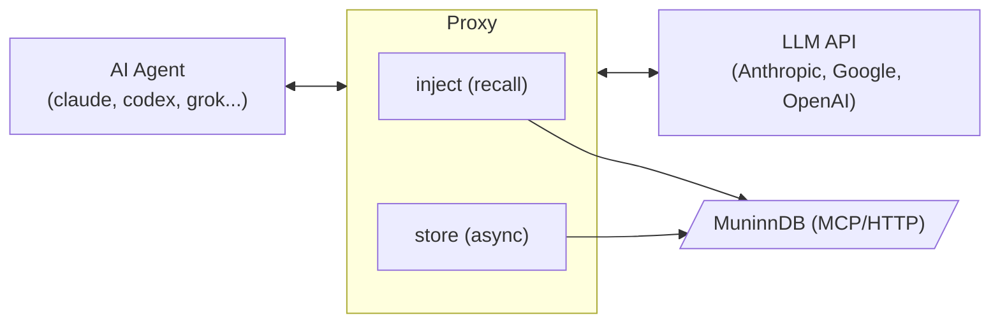

# Muninn Sidecar Architecture

## What It Does

Muninn Sidecar (`msc`) is a transparent reverse proxy that sits between AI coding agents (Claude Code, Codex, Grok, Aider, etc.) and their LLM API backends. It captures every API exchange — request and response — and stores them as memories in [MuninnDB](https://github.com/scrypster/muninn), a semantic memory graph. On subsequent requests, it recalls relevant memories and injects them as system-level context before the request reaches the upstream API.

The agent doesn't know the proxy exists. From its perspective, it's talking directly to the API.

## Why It Exists

AI coding agents are stateless by design. Each session starts from zero — the agent has no memory of what you worked on yesterday, what decisions were made, or what patterns emerged across conversations. Context windows are large but finite, and nothing persists beyond a single session.

Muninn Sidecar solves this by creating a persistent, semantic memory layer that works with *any* agent. Instead of relying on each agent's proprietary memory system (if it has one), msc captures the actual API traffic and stores it in MuninnDB, where it can be semantically searched and recalled across sessions, agents, and projects.

### Key Benefits

- **Cross-session continuity**: Memories from yesterday's debugging session surface automatically when you encounter the same codebase area today.
- **Cross-agent memory**: Work done in Claude Code is available when you switch to Codex or Aider. The memory layer is agent-agnostic.
- **Zero configuration for the agent**: No plugins, no agent modifications, no custom prompts. Override one environment variable and everything works.
- **Semantic, not keyword**: MuninnDB uses embedding-based search. A conversation about "fixing the auth middleware" will surface when you later ask about "login security issues."
- **Gradual context**: The session memory window with decay means relevant memories persist across turns while stale ones fade naturally, rather than abruptly appearing and disappearing.

## How It Works



### Request Flow

1. **Agent sends request** to what it thinks is the real API (e.g., `https://api.anthropic.com`), but `msc` has overridden `ANTHROPIC_BASE_URL` to point at `http://127.0.0.1:<port>`.

2. **Proxy intercepts** the request in `ServeHTTP`. If the path matches the agent's configured capture paths (e.g., `/v1/messages` for Claude), the request body is buffered.

3. **Memory injection** (if enabled): The `Injector` builds a recall query from the latest user turn (concatenating prior turns measurably hurts retrieval — see [docs/experiments.md](docs/experiments.md)) and — unless this is a continuation of the same query (a tool-use round), in which case it reuses the session window without re-querying — sends a `semantic`-mode recall to MuninnDB, merges results into the session memory window (with decay), **selects** which of the merged memories are actually worth injecting (an absolute confidence threshold that both suppresses noise-only turns and picks the confident memories, plus near-duplicate removal), and formats the survivors as a `<retrieved-context>` XML block injected into the system prompt. On the first request, it also fetches `where_left_off` (previous session context) and `guide` (global guidelines).

4. **Forward to upstream**: The (possibly enriched) request is forwarded to the real API via `httputil.ReverseProxy`. SSE streaming responses flow through in real-time with `FlushInterval: -1`.

5. **Capture response**: For non-streaming responses, the body is read, captured, and re-wrapped. For SSE streams, a `streamCapture` wrapper tees data through while incrementally accumulating text deltas from content events (Anthropic, OpenAI, and Gemini delta formats).

6. **Filter and store**: Before storage, the captured exchange is cleaned:
   - Injected context markers (`<retrieved-context>`, `<session-context>`, `<global-guide>`) are stripped from the request to prevent recursive reinforcement.
   - MuninnDB tool calls (`muninn_*`) and their results are filtered from both request and response bodies.
   - Tool definitions matching filter patterns are removed (they're large JSON schemas that add noise).
   - System-reminder blocks are stripped from user messages.
   - Agent-internal noise content (e.g. Claude Code context continuations and summarization requests) is filtered by prefix matching.
   - Empty exchanges (no meaningful user or assistant text) are skipped.
   - Duplicate concepts are deduplicated via a ring buffer.

7. **Async delivery**: The cleaned exchange is enqueued to a buffered channel (depth 256). A background worker batches up to 10 exchanges per flush, sending them to MuninnDB every 2 seconds via `muninn_remember` (single item) or `muninn_remember_batch` (multiple items).

## Package Structure

```
cmd/msc/                 CLI entry point, flag parsing, agent lifecycle
  main.go                Entry point, agent launch, signal handling
  flags.go               Flag parsing, config resolution
  commands.go            list, status, version commands
  completion.go          Shell completion scripts (bash, zsh, fish)
  util.go                Logging helpers, typo suggestions
cmd/msc-eval/            Injection-quality evaluation CLI (offline + live)
  main.go                Scenario loading, report tables, MinScore sweep, method study
cmd/msc-bench/           Real-MuninnDB retrieval + when-to-inject benchmark
  main.go                Seed labeled corpus, probe, sweep score vs vector_score
  facts.go               Distinct-subject corpus + unrelated absent probes
internal/
  agents/agents.go        Agent registry (claude, codex, grok, reasonix, agy, ...)
  apiformat/apiformat.go  Format detection & message extraction (Anthropic/OpenAI/Gemini)
  inject/
    inject.go             Memory recall, session window with decay, selection, enrichment
    format.go             Context block formatting, budget packing, per-format injection
    eval.go               Offline selection-quality harness (precision/recall/F1, nDCG, gate, sweep)
    eval_study.go         Synthetic scenario generator + candidate when+what methods
    eval_cv.go            Cross-validation engine + method study entry point
    eval_live.go          Live end-to-end evaluation against a real MuninnDB
  mcpclient/client.go     Shared JSON-RPC 2.0 client for MuninnDB
  mitm/
    ca.go                 Local CA: generate/persist + mint cached per-host leaf certs
    host.go               Host normalization & SAN selection (DNS vs IP)
  redact/redact.go        Secret scrubbing (API keys/tokens/key=value) for store + inject
  proxy/
    proxy.go              Reverse proxy, request/response capture, token extraction
    mitm.go               CONNECT handler: TLS-terminate, intercept, re-originate TLS
    filter.go             Anti-recursion filters (strip injected context, tool calls)
    stream.go             SSE/ndjson stream capture and synthetic response building
    context.go            Request-scoped capture metadata via context.Value
  stats/stats.go          Session statistics (atomic counters)
  store/muninn.go         Async exchange delivery with batching, dedup, retry
```

## Key Design Decisions

### Transparent Interception via Environment Variables

Each coding agent reads its API base URL from an environment variable (`ANTHROPIC_BASE_URL`, `OPENAI_BASE_URL`, `CODE_ASSIST_ENDPOINT`, etc.). `msc` overrides this variable to point at the local proxy, then forwards to the real upstream. This requires zero changes to the agent and works with any version of any supported agent.

A few agents take their base URL from a CLI flag rather than an env var (e.g. Qwen Code's `--openai-base-url`). For those, the agent's `ProxyArgs` carry the flags with a `{proxy}` placeholder that `Exec` substitutes with the live proxy URL — the same transparent redirect, delivered as args instead of env.

The `MSC_UPSTREAM` sentinel prevents infinite loops when msc is accidentally nested — a child msc instance reads the real upstream from the sentinel rather than picking up the inner proxy's address from the environment.

### TLS-MITM Interception (opt-in, `--mitm`)

Some agents ignore the base-URL override and reach their provider directly (codex ChatGPT-subscription mode, grok session auth, agy/antigravity OAuth). For these, `--mitm` makes msc a transparent HTTPS proxy instead. A local certificate authority (`internal/mitm`) generates and persists a CA under the user config dir (`~/.config/muninn-sidecar/mitm/`, `0600` key) and mints cached per-host leaf certs on demand. The child is launched with `HTTP(S)_PROXY`/`ALL_PROXY` (both cases) pointing at msc and `NODE_EXTRA_CA_CERTS`/`SSL_CERT_FILE`/`REQUESTS_CA_BUNDLE`/`CURL_CA_BUNDLE` pointing at the CA cert. When the agent opens an HTTPS `CONNECT` tunnel, `proxy.handleConnect` hijacks it, terminates TLS with a minted leaf, and serves the decrypted requests through the **same** recall/inject + capture pipeline (`instrument`) as the plain path, re-originating TLS to the real upstream via a per-tunnel `httputil.ReverseProxy`.

The child env covers every runtime our agents use, verified with a per-runtime interception probe (the record-upstream's cert is trusted by msc but not the client, so a successful response *proves* the request went through msc rather than directly): Node/undici `fetch` (claude, qwen, reasonix), Rust/`reqwest` (codex, grok), Bun (opencode), Deno, Python (aider), Go (agy). The non-obvious one: Node's global `fetch` ignores `HTTPS_PROXY` unless `NODE_USE_ENV_PROXY=1` (Node 24+), so msc sets that too — otherwise the most common agent family (Anthropic/OpenAI SDKs on undici) would silently bypass the proxy.

By default every CONNECT host is terminated (the agents that need MITM often talk to a backend that isn't their nominal API host). `--mitm-host` scopes interception to the upstream + listed hosts; all others are **blind-tunneled** (`blindTunnel` — a plain TCP splice with no TLS termination), so package registries and cert-pinned services are never decrypted.

WebSocket capture: an intercepted protocol upgrade (e.g. codex ChatGPT-mode, which streams the OpenAI Responses API over a permessage-deflate WebSocket) is spliced raw to the backend so the agent keeps working, while a best-effort copy is decoded — RFC 6455 framing (`wsframe.go`) + RFC 7692 context-takeover inflation, accumulating `response.output_text` deltas and pairing them with the `response.create` request (`wscapture.go`). Decoding runs on a copy that abandons under backpressure, so it can never block or alter forwarding. The decoded turn is fed to the normal store pipeline (extraction, redaction, dedup).

Security model: the CA private key is generated locally, stored `0600`, and never leaves the machine; trust is scoped to the launched child via env vars only — msc never touches the system trust store. MITM is off unless `--mitm` is explicitly passed.

### Format-Agnostic API Handling

The `apiformat` package detects whether a request uses Anthropic, OpenAI, Gemini, or Gemini Cloud Code format and provides unified extraction interfaces. This means the proxy and store don't need format-specific code paths — they call `apiformat.ExtractUserMessage()`, `apiformat.ExtractAssistantMessage()`, etc., and the format package handles the differences. The inject package uses `apiformat` for detection and extraction but has its own format-specific injection logic (appending to Anthropic system arrays, inserting OpenAI system messages or OpenAI Responses API instructions, or extending Gemini systemInstruction parts).

Detection priority: Gemini (`contents` key) > Gemini Cloud Code (`request.contents`) > Anthropic (`system` key or content blocks with `type`) > OpenAI Responses (`input` key) > OpenAI (`messages` key, fallback).

### Session Memory Window with Exponential Decay

Rather than treating each turn as independent (recalling fresh memories and discarding previous ones), the injector maintains a rolling window of memories across turns. When a memory is recalled, it enters the window at its original relevance score. On subsequent turns where it isn't re-recalled, its effective score decays by 0.7x per turn. When it drops below 0.2, it's evicted.

This means a relevant memory recalled with score 0.85 persists for ~4 turns without being re-recalled, providing continuity even when the conversation topic drifts slightly. If a memory *is* re-recalled, its score refreshes to the new recall score.

### Selection: When and What to Inject

Recall and decay decide which memories *exist* in the window; selection decides which are actually injected on a given turn. This is two questions at once — *when* (should this turn inject anything?) and *what* (which memories?) — and the method was chosen empirically rather than by intuition (see "Choosing the Method" below).

**Which signal to threshold matters as much as the threshold.** MuninnDB returns two relevance numbers per recalled memory: `score`, a composite that folds in recency and graph traversal (it can exceed 1.0), and `vector_score`, the raw embedding cosine. A benchmark against a real instance (`cmd/msc-bench`, below) found `score` cannot separate relevant from irrelevant *at any threshold* — unrelated-topic queries score as high as on-topic ones — while `vector_score` separates cleanly. So `normalizeRelevance` rewrites each memory's working score to its cosine (falling back to the composite only when the cosine field is absent), and the whole pipeline below operates on cosine.

The winner is a **single absolute confidence threshold**. `selectForInjection` keeps every memory whose effective (post-decay) cosine is at least `MinScore` (default **0.6**), then removes near-duplicates:

1. **Absolute threshold**: keep memories with effective score ≥ `MinScore`. Because this drops *every* candidate when none is confident enough, one threshold answers both questions: an empty result suppresses the turn (*when*), and the survivors are the injection (*what*). A turn whose strongest match is only weakly relevant — a generic opener, an off-topic question — injects nothing, which is better than injecting noise that spends budget and dilutes the real prompt.

   Before the threshold, memories MuninnDB marks as **explicitly dead or untrusted are excluded** regardless of cosine: lifecycle state `archived` (retired) or `cancelled` (abandoned), or trust level `untrusted` (flagged unreliable). Surfacing those as current context misleads the agent. `completed` is kept (a finished task's decisions stay relevant); empty/unrecognized values are kept, so vaults that don't populate these fields are unaffected.

2. **Near-duplicate removal**: a memory is dropped if it duplicates an already-kept memory — by identical normalized concept, or by word-set Jaccard overlap ≥ 0.8. This stops re-phrasings and supersets of the same fact from spending budget twice. (Dedup is orthogonal to the threshold and applied on top of whatever method wins.)

   For **same-concept** duplicates (one concept = one fact) the *current* memory wins, not the higher-cosine one: recall ranks by similarity, so without this an outdated fact ("we use MySQL") can be injected over the current one ("migrated to Postgres") whenever its cosine is marginally higher. The injector recalls with `annotate:true` and uses MuninnDB's authoritative `stale` flag — a non-stale memory supersedes a stale duplicate — falling back to `created_at` (RFC3339 UTC, lexical = chronological) when staleness matches. This is the anti-staleness behavior a long-lived vault needs. (Staleness is age-based, not wrongness, so a *lone* stale memory is still injected — it may be the only answer; only duplicates are pruned. MuninnDB also tends to surface the current version directly for a natural query, so this is a backstop for when both versions are recalled.) Cross-concept content-overlap dups still keep the higher-cosine one (they may be genuinely distinct facts).

   **Contradiction resolution**: when MuninnDB's `annotate:true` flags two recalled memories as contradicting (`conflicts_with`), injecting both would feed the agent mutually-exclusive facts ("deploys to AWS" + "never AWS, only GCP"). `resolveConflicts` keeps only the superseding side (non-stale, then newer) and drops the other — across concepts, not just within one. This uses MuninnDB's contradiction graph, which the agent populates as it corrects itself.

The greedy token-budget packer then runs over the survivors. Note the interaction with decay: a memory injected at score 0.9 keeps being injected while its decayed score stays ≥ 0.5 (≈2 turns of non-recall), then drops out as stale even though it remains in the window (above the 0.2 eviction floor) and can be revived by a fresh recall.

### Choosing the Method

The threshold and the single-knob shape were not hand-picked — they won a cross-validated bake-off (`internal/inject/eval_study.go`, `eval_cv.go`). Five candidate when+what strategies were compared on 600 synthetic scenarios drawn from *overlapping* relevant/noise score distributions (so no threshold separates them cleanly), using 5-fold cross-validation: each method's hyperparameters are tuned on training folds and scored on a held-out test fold, so the numbers reflect generalization, not memorization. Held-out macro-F1 (which rewards correct suppression *and* correct selection):

| method | F1 (held-out) | gate acc | wasted | note |
|---|---|---|---|---|
| **absolute** (1 knob) | **0.913** | 95% | 4% | winner — simplest, least wasteful |
| absfloor + relative (2 knobs) | 0.910 | 95% | 7% | ties within noise, more complex |
| relative-only (no suppression) | 0.870 | 92% | 15% | can't decide *when* |
| fixed top-k above recall floor | 0.821 | 92% | 19% | legacy baseline |
| absfloor + gap-cut | 0.810 | 95% | 2% | over-suppresses, recall suffers |

Two conclusions: methods that make an explicit *when* decision beat those that always inject (gate accuracy 95% vs 92%, much less wasted budget) — so a suppression decision is necessary; and the single absolute threshold matches the more complex two-knob method while being simpler and wasting less, so it wins on Occam. A finer threshold sweep is flat-topped over [0.48, 0.52] across five seeds, peaking at **0.50** (below it, low scores are indistinguishable from noise; above it, recall drops as real matches get suppressed) — hence the default. `TestMethodStudy` guards that "absolute" stays the winner and its tuned threshold stays near 0.5.

The dataset is synthetic but principled; its score distributions are calibrated to the embedding cosines observed on a real instance (below).

> A standalone, consolidated write-up of the recall/injection decisions, the evaluation methodology, and how to re-tune on your own data lives in [docs/recall-and-injection.md](docs/recall-and-injection.md).

### Deciding When to Recall (and How)

Selection above decides *what* to inject from recall results; two earlier decisions govern the recall itself, both tuned on the real-MuninnDB benchmark:

- **When to ask.** Recall costs an MCP round-trip on the request hot path, and a coding agent resends the *same* user message every round of a tool-use chain (with new tool results appended). Firing a fresh recall each time is wasted latency. The injector hashes the recall query (FNV-1a over the last user turns, system-reminders stripped) and, when it is unchanged *and* the session window still holds memories, **reuses the window instead of recalling** — a continuation neither re-queries nor advances decay. The turn counter therefore tracks distinct *intents*, not raw requests. First turn and an empty window always recall. This is a hash compare in `Enrich`, fully in-flight and transparent to the agent.
- **How to ask.** MuninnDB exposes recall presets. The benchmark compared all four on a labeled SQuAD corpus: `semantic` (pure high-precision vector search) gave the best retrieval (R@1 0.21, MRR 0.234), beating `balanced` (current), `deep` (4-hop graph traversal adds noise), and `recent` (recency-biased, worst). The injector requests `semantic` (`RecallMode`, default).

### Validating on Real MuninnDB

The synthetic study answers "which method, which threshold" in the abstract. `cmd/msc-bench` checks it against a real MuninnDB: it seeds a large labeled corpus into a dedicated vault, then probes with queries whose correct answer is known, measuring retrieval (Recall@k, MRR) and the when-to-inject gate, sweeping thresholds on both `score` and `vector_score`. On a corpus of distinct-subject memories with genuinely-unrelated absent probes:

- **Retrieval** by `vector_score` was perfect on the distinct-subject corpus (R@1 = 1.00, MRR = 1.00); by the composite `score` it degraded to R@1 = 0.88. On SQuAD, exact-paragraph R@1 was only ~0.21 — but that is sibling-paragraph ambiguity *within the same Wikipedia article*; **article-level** retrieval (any paragraph from the correct article) was R@1 = 0.93, MRR = 0.95. Topic retrieval — the level injection actually needs — is excellent; exact-paragraph disambiguation among near-identical siblings is the only hard part, and it doesn't matter for usefulness.
- **When-to-inject** gating on `vector_score` was perfect at a 0.6 threshold (inject-when-should = 1.00, suppress-when-absent = 1.00), with a clean plateau over [0.575, 0.675]. Gating the composite `score` never exceeded ~0.3 suppression at any threshold — it cannot tell relevant from irrelevant.

This is what fixed the production gate to use `vector_score` and set `MinScore` to 0.6. Two honest caveats the benchmark also surfaced: when stored memories are near-duplicates of each other, neither retrieval nor gating can separate them (inherent to vector search, not a bug); and the gate decides *topic present vs absent* well but cannot distinguish "right topic, wrong specific entity" from a true hit on score alone. Run `go run ./cmd/msc-bench -seed -probe -corpus facts -vault msc-bench`.

### Evaluating Injection Quality

Selection is a heuristic, so it ships with an evaluation harness (`internal/inject/eval.go`, CLI at `cmd/msc-eval`) that measures whether injected memories are actually useful and whether the selection choices hold up.

- **Offline layer** (deterministic, CI-gated): a labeled corpus (`internal/inject/testdata/scenarios.json`) gives each candidate a simulated recall score and a gold relevance label, plus a `should_inject` gate label per scenario. `RunScenario` feeds candidates through the real `selectForInjection` + `withinBudget` pipeline and scores the outcome: **precision/recall/F1** (did we inject the useful memories and skip noise?), **gate accuracy** (was the inject-vs-suppress decision right?), **nDCG** (are injected memories ordered by true relevance?), and **budget efficiency**. `TestCorpusRegression` fails CI if aggregate quality drops below floors.
- **MinScore sweep**: `SweepMinScore` (`msc-eval -sweep`) charts gate accuracy, precision/recall, and wasted budget across thresholds on the corpus. It plateaus at perfect over [0.46, 0.52], independently confirming the 0.5 default chosen by the synthetic study; `TestMinScoreThresholdImproves` guards it.
- **Method study**: `RunMethodStudy` (`msc-eval -compare`) runs the cross-validated comparison above.
- **Live layer** (`internal/inject/eval_live.go`, opt-in): seeds a throwaway MuninnDB vault and exercises the full recall + selection path, reporting how many expected concepts were injected. This covers recall quality (embedding search) on top of selection quality. It has side effects and needs a running server, so it runs only via `msc-eval -live`, never in the normal test suite — and is the way to re-tune `MinScore` against real score distributions.

Run `make eval` for the offline report + sweep, `go run ./cmd/msc-eval -compare` for the method study, or `go run ./cmd/msc-eval -json` for machine-readable output.

### Async Delivery with Batching and Dedup

Storing to MuninnDB is entirely async — the proxy never blocks on a MuninnDB call. Exchanges flow through a buffered channel to a single worker goroutine that batches up to 10 per flush and sends them every 2 seconds. This amortizes MCP call overhead while keeping delivery latency bounded.

The dedup ring buffer (`[8]map[uint64]struct{}`) prevents the same concept from being stored multiple times within a short window. In tool-use chains, the agent often sends the same user message multiple times with different tool results — the dedup ring catches these. Each ring slot holds a set of FNV-1a concept hashes; the ring advances one slot per flush cycle (~2s), so hashes expire after ~16 seconds.

### Anti-Recursion Filtering

Without filtering, each stored exchange would embed the full conversation history — including previously injected memories and MuninnDB tool calls. On the next recall cycle, these would be recalled and re-injected, compounding infinitely. The filter pipeline prevents this by:

1. Stripping `<retrieved-context>`, `<session-context>`, and `<global-guide>` blocks from request bodies before storage, plus a generic fallback that matches any XML tag carrying a `source="muninn"` attribute.
2. Removing all `muninn_*` tool_use/tool_result blocks (Anthropic format) and tool_calls/tool messages (OpenAI format) from both request and response bodies.
3. Removing muninn tool definitions from the `tools` array.

### Secret Redaction

Coding agents routinely carry API keys, tokens, and `.env` contents in their context. Storing those verbatim in a long-term memory graph is a leak that persists and resurfaces on recall. The shared `internal/redact` package scrubs well-known credential formats — provider key prefixes (`sk-`, `AKIA`, `gh*_`, `AIza`, Slack/Stripe/npm, JWTs, `Bearer`/Basic headers, PEM private-key blocks) and sensitive `key=value` / `key: value` assignments (the pasted-`.env` case, value redacted, key kept) — to a `[REDACTED]` marker. Patterns are deliberately conservative (anchored to distinctive prefixes/structures or sensitive key names) to avoid corrupting prose.

It runs on **both** sides: before a captured exchange is stored (`--no-redact` disables this for full-fidelity local capture in trusted environments), and — always, as defense in depth — on recalled memory content before it is injected into an outgoing request, so a secret stored by another client or before redaction existed isn't re-transmitted to the provider in a session where it wasn't otherwise present. It reduces, not eliminates, leak risk.

### SSE Stream Capture

Streaming responses (SSE/ndjson) can't be buffered — they need to flow through to the agent in real-time. The `streamCapture` wrapper tees data through via `Read()` while incrementally parsing SSE `data:` lines. Text deltas are accumulated from content events across all three API formats (Anthropic `content_block_delta`, OpenAI `choices[].delta.content` / `response.output_text.delta`, Gemini `candidates[].content.parts[].text`). Tool names are also captured from `content_block_start` events (Anthropic), `response.output_item.added` events (OpenAI Responses), `choices[].delta.tool_calls` (OpenAI chat), and `functionCall` parts (Gemini). At EOF, a synthetic Anthropic-format response is built from the accumulated text and tool_use blocks for storage, with usage metadata merged from the last usage-bearing event. Falls back to the last `data:` line if no text deltas or tool names were captured.

Safety bounds: line buffer capped at 1 MiB, text accumulation capped at 16 KiB, gzip decompression for non-streaming responses capped at 50 MiB.

### Shared MCP Client

Both the `store` and `inject` packages communicate with MuninnDB via JSON-RPC 2.0 (`tools/call`). The `mcpclient` package provides a shared client with typed errors: `ServerError` (5xx, retryable) and `ClientError` (4xx, not retryable). The store wraps this with retry logic (up to 3 attempts with exponential backoff); the injector uses it directly with tight timeouts (200ms default) since injection is latency-sensitive.

## Configuration

Msc uses a flag-first, env-fallback, sensible-defaults approach:

| Setting | Flag | Environment | Default |
|---|---|---|---|
| MuninnDB endpoint | `--mcp-url` | `MUNINN_MCP_URL` | `http://127.0.0.1:8750/mcp` |
| Auth token | `--token` | `MUNINN_TOKEN` | `~/.muninn/mcp.token` |
| Vault name | `--vault` | `MSC_VAULT` | Current directory name (fallback: `sidecar`) |
| Injection | `--no-inject` | — | Enabled |
| Injection budget | `--inject-budget` | — | 2048 tokens |
| Recall threshold | — | — | 0.05 (composite-score floor sent to MuninnDB; kept below the gate's calibration floor so it never pre-empts the cosine gate) |
| Injection threshold (`MinScore`) | `--inject-min-score` | — | 0.6 prior, then auto-calibrated per vault |
| Auto-calibrate gate | `--no-auto-calibrate` (disable) | — | On (self-tunes `MinScore` to the score distribution) |
| Recall mode (`RecallMode`) | `--recall-mode` | — | semantic (best retrieval; real-MuninnDB benchmark) |
| Answer-grounding rerank (`Grounder`) | `--ground-url` / `--ground-cmd` | — | Off (opt-in precision step; see docs/experiments §B4) |
| Grounding model / breadth | `--ground-model` / `--ground-topk` | — | qwen2.5:7b-instruct / top-3 |
| Grounding in-flight timeout | `--ground-timeout` | — | 10s (slow judge fails open to the cosine gate) |
| Recall timeout | — | — | 200ms per MCP call |
| Debug logging | `--debug` | — | Off (WARN level) |

## Supported Agents

| Agent | Binary | Env Var | Default Upstream |
|---|---|---|---|
| Claude Code | `claude` | `ANTHROPIC_BASE_URL` | `api.anthropic.com` |
| Codex | `codex` | `OPENAI_BASE_URL` | `api.openai.com` |
| OpenCode | `opencode` | `OPENAI_BASE_URL` | `api.openai.com` |
| Aider | `aider` | `OPENAI_API_BASE` | `api.openai.com` |
| Grok | `grok` | `GROK_MODELS_BASE_URL` | `api.x.ai/v1` |
| reasonix | `reasonix` | `DEEPSEEK_BASE_URL` | `api.deepseek.com/v1` |
| Qwen Code | `qwen` | `--openai-base-url` flag (injected) | `dashscope-intl.aliyuncs.com/compatible-mode/v1` |
| Antigravity*† | `agy` / `antigravity` | `CODE_ASSIST_ENDPOINT` | `cloudcode-pa.googleapis.com` |

*\* Antigravity (`antigravity`) is currently broken and gated behind `MSC_EXPERIMENTAL_ANTIGRAVITY=1`.*

*† `agy` (Google Antigravity CLI) is registered but authenticates via OAuth and talks to its upstream directly, ignoring the base-URL env override — so the proxy cannot currently capture or inject for it. The Gemini CLI agent was removed (deprecated upstream); the Gemini/Code-Assist API format is still supported for these agents.*

Adding a new agent requires only adding an entry to the `Registry` map in `internal/agents/agents.go`.
