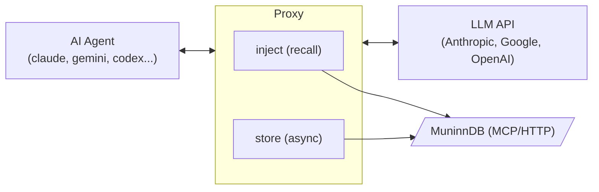

# Muninn Sidecar Architecture

## What It Does

Muninn Sidecar (`msc`) is a transparent reverse proxy that sits between AI coding agents (Claude Code, Gemini CLI, Codex, Aider, etc.) and their LLM API backends. It captures every API exchange — request and response — and stores them as memories in [MuninnDB](https://github.com/scrypster/muninn), a semantic memory graph. On subsequent requests, it recalls relevant memories and injects them as system-level context before the request reaches the upstream API.

The agent doesn't know the proxy exists. From its perspective, it's talking directly to the API.

## Why It Exists

AI coding agents are stateless by design. Each session starts from zero — the agent has no memory of what you worked on yesterday, what decisions were made, or what patterns emerged across conversations. Context windows are large but finite, and nothing persists beyond a single session.

Muninn Sidecar solves this by creating a persistent, semantic memory layer that works with *any* agent. Instead of relying on each agent's proprietary memory system (if it has one), msc captures the actual API traffic and stores it in MuninnDB, where it can be semantically searched and recalled across sessions, agents, and projects.

### Key Benefits

- **Cross-session continuity**: Memories from yesterday's debugging session surface automatically when you encounter the same codebase area today.
- **Cross-agent memory**: Work done in Claude Code is available when you switch to Gemini or Aider. The memory layer is agent-agnostic.
- **Zero configuration for the agent**: No plugins, no agent modifications, no custom prompts. Override one environment variable and everything works.
- **Semantic, not keyword**: MuninnDB uses embedding-based search. A conversation about "fixing the auth middleware" will surface when you later ask about "login security issues."
- **Gradual context**: The session memory window with decay means relevant memories persist across turns while stale ones fade naturally, rather than abruptly appearing and disappearing.

## How It Works



### Request Flow

1. **Agent sends request** to what it thinks is the real API (e.g., `https://api.anthropic.com`), but `msc` has overridden `ANTHROPIC_BASE_URL` to point at `http://127.0.0.1:<port>`.

2. **Proxy intercepts** the request in `ServeHTTP`. If the path matches the agent's configured capture paths (e.g., `/v1/messages` for Claude), the request body is buffered.

3. **Memory injection** (if enabled): The `Injector` extracts the last 3 turns of conversation, sends a semantic recall query to MuninnDB, merges results into the session memory window (with decay), and formats them as a `<retrieved-context>` XML block injected into the system prompt. On the first request, it also fetches `where_left_off` (previous session context) and `guide` (global guidelines).

4. **Forward to upstream**: The (possibly enriched) request is forwarded to the real API via `httputil.ReverseProxy`. SSE streaming responses flow through in real-time with `FlushInterval: -1`.

5. **Capture response**: For non-streaming responses, the body is read, captured, and re-wrapped. For SSE streams, a `streamCapture` wrapper tees data through while incrementally accumulating text deltas from content events (Anthropic, OpenAI, and Gemini delta formats).

6. **Filter and store**: Before storage, the captured exchange is cleaned:
   - Injected context markers (`<retrieved-context>`, `<session-context>`, `<global-guide>`) are stripped from the request to prevent recursive reinforcement.
   - MuninnDB tool calls (`muninn_*`) and their results are filtered from both request and response bodies.
   - Tool definitions matching filter patterns are removed (they're large JSON schemas that add noise).
   - System-reminder blocks are stripped from user messages.
   - Empty exchanges (no meaningful user or assistant text) are skipped.
   - Duplicate concepts are deduplicated via a ring buffer.

7. **Async delivery**: The cleaned exchange is enqueued to a buffered channel (depth 256). A background worker batches up to 10 exchanges per flush, sending them to MuninnDB every 2 seconds via `muninn_remember_batch`.

## Package Structure

```
cmd/msc/main.go          CLI entry point, flag parsing, agent lifecycle
internal/
  agents/agents.go        Agent registry (claude, gemini, codex, aider, etc.)
  apiformat/apiformat.go  Format detection & message extraction (Anthropic/OpenAI/Gemini)
  inject/
    inject.go             Memory recall, session window with decay, enrichment
    format.go             Context block formatting, per-format injection
  mcpclient/client.go     Shared JSON-RPC 2.0 client for MuninnDB
  proxy/
    proxy.go              Reverse proxy, SSE stream capture, token extraction
    filter.go             Anti-recursion filters (strip injected context, tool calls)
    context.go            Request-scoped capture metadata via context.Value
  stats/stats.go          Session statistics (atomic counters)
  store/muninn.go         Async exchange delivery with batching, dedup, retry
```

## Key Design Decisions

### Transparent Interception via Environment Variables

Each coding agent reads its API base URL from an environment variable (`ANTHROPIC_BASE_URL`, `OPENAI_BASE_URL`, `CODE_ASSIST_ENDPOINT`, etc.). Msc overrides this variable to point at the local proxy, then forwards to the real upstream. This requires zero changes to the agent and works with any version of any supported agent.

The `MSC_UPSTREAM` sentinel prevents infinite loops when msc is accidentally nested — a child msc instance reads the real upstream from the sentinel rather than picking up the inner proxy's address from the environment.

### Format-Agnostic API Handling

The `apiformat` package detects whether a request uses Anthropic, OpenAI, Gemini, or Gemini Cloud Code format and provides unified extraction interfaces. This means the proxy and store don't need format-specific code paths — they call `apiformat.ExtractUserMessage()`, `apiformat.ExtractAssistantMessage()`, etc., and the format package handles the differences. The inject package uses `apiformat` for detection and extraction but has its own format-specific injection logic (appending to Anthropic system arrays, inserting OpenAI system messages, or extending Gemini systemInstruction parts).

Detection priority: Gemini (`contents` key) > Anthropic (`system` key or content blocks with `type`) > OpenAI (`messages` key, fallback).

### Session Memory Window with Exponential Decay

Rather than treating each turn as independent (recalling fresh memories and discarding previous ones), the injector maintains a rolling window of memories across turns. When a memory is recalled, it enters the window at its original relevance score. On subsequent turns where it isn't re-recalled, its effective score decays by 0.7x per turn. When it drops below 0.2, it's evicted.

This means a relevant memory recalled with score 0.85 persists for ~4 turns without being re-recalled, providing continuity even when the conversation topic drifts slightly. If a memory *is* re-recalled, its score refreshes to the new recall score.

### Async Delivery with Batching and Dedup

Storing to MuninnDB is entirely async — the proxy never blocks on a MuninnDB call. Exchanges flow through a buffered channel to a single worker goroutine that batches up to 10 per flush and sends them every 2 seconds. This amortizes MCP call overhead while keeping delivery latency bounded.

The dedup ring buffer (`[8]map[uint64]struct{}`) prevents the same concept from being stored multiple times within a short window. In tool-use chains, the agent often sends the same user message multiple times with different tool results — the dedup ring catches these. Each ring slot holds a set of FNV-1a concept hashes; the ring advances one slot per flush cycle (~2s), so hashes expire after ~16 seconds.

### Anti-Recursion Filtering

Without filtering, each stored exchange would embed the full conversation history — including previously injected memories and MuninnDB tool calls. On the next recall cycle, these would be recalled and re-injected, compounding infinitely. The filter pipeline prevents this by:

1. Stripping `<retrieved-context>`, `<session-context>`, and `<global-guide>` blocks from request bodies before storage.
2. Removing all `muninn_*` tool_use/tool_result blocks (Anthropic format) and tool_calls/tool messages (OpenAI format) from both request and response bodies.
3. Removing muninn tool definitions from the `tools` array.

### SSE Stream Capture

Streaming responses (SSE/ndjson) can't be buffered — they need to flow through to the agent in real-time. The `streamCapture` wrapper tees data through via `Read()` while incrementally parsing SSE `data:` lines. Text deltas are accumulated from content events across all three API formats (Anthropic `content_block_delta`, OpenAI `choices[].delta.content` / `response.output_text.delta`, Gemini `candidates[].content.parts[].text`). At EOF, a synthetic Anthropic-format response is built from the accumulated text for storage, with usage metadata merged from the last usage-bearing event.

Safety bounds: line buffer capped at 1 MiB, text accumulation capped at 16 KiB.

### Shared MCP Client

Both the `store` and `inject` packages communicate with MuninnDB via JSON-RPC 2.0 (`tools/call`). The `mcpclient` package provides a shared client with typed errors: `ServerError` (5xx, retryable) and `ClientError` (4xx, not retryable). The store wraps this with retry logic (up to 3 attempts with exponential backoff); the injector uses it directly with tight timeouts (200ms default) since injection is latency-sensitive.

## Configuration

Msc uses a flag-first, env-fallback, sensible-defaults approach:

| Setting | Flag | Environment | Default |
|---|---|---|---|
| MuninnDB endpoint | `--mcp-url` | `MUNINN_MCP_URL` | `http://127.0.0.1:8750/mcp` |
| Auth token | `--token` | `MUNINN_TOKEN` | `~/.muninn/mcp.token` |
| Vault name | `--vault` | `MSC_VAULT` | Current directory name |
| Injection | `--no-inject` | — | Enabled |
| Injection budget | `--inject-budget` | — | 2048 tokens |
| Debug logging | `--debug` | — | Off (WARN level) |

## Supported Agents

| Agent | Binary | Env Var | Default Upstream |
|---|---|---|---|
| Claude Code | `claude` | `ANTHROPIC_BASE_URL` | `api.anthropic.com` |
| Gemini CLI | `gemini` | `CODE_ASSIST_ENDPOINT` | `cloudcode-pa.googleapis.com` |
| Antigravity* | `antigravity` | `CODE_ASSIST_ENDPOINT` | `cloudcode-pa.googleapis.com` |
| Codex | `codex` | `OPENAI_BASE_URL` | `api.openai.com` |
| OpenCode | `opencode` | `OPENAI_BASE_URL` | `api.openai.com` |
| Aider | `aider` | `OPENAI_API_BASE` | `api.openai.com` |

*\* Antigravity support is currently broken. It is hidden behind the `MSC_EXPERIMENTAL_ANTIGRAVITY=1` environment variable feature gate.*

Adding a new agent requires only adding an entry to the `Registry` map in `internal/agents/agents.go`.
