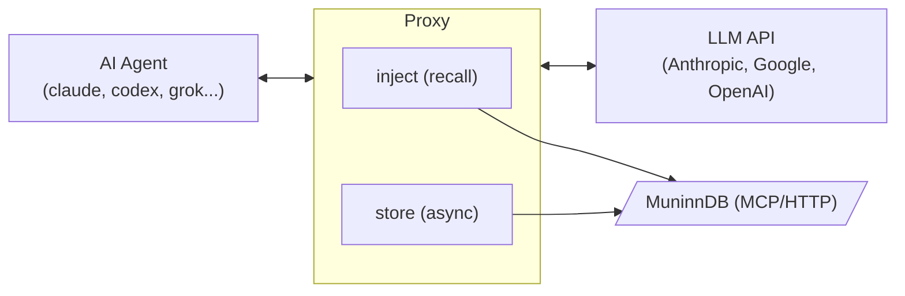

# Muninn Sidecar Architecture

## What It Does

Muninn Sidecar (`msc`) is a transparent reverse proxy that sits between AI coding agents (Claude Code, Codex, Grok, Aider, etc.) and their LLM API backends. It captures every API exchange — request and response — and stores them as memories in [MuninnDB](https://github.com/scrypster/muninn), a semantic memory graph. On subsequent requests, it recalls relevant memories and injects them as system-level context before the request reaches the upstream API.

The agent doesn't know the proxy exists. From its perspective, it's talking directly to the API.

## Why It Exists

AI coding agents are stateless by design. Each session starts from zero — the agent has no memory of what you worked on yesterday, what decisions were made, or what patterns emerged across conversations. Context windows are large but finite, and nothing persists beyond a single session.

Muninn Sidecar solves this by creating a persistent, semantic memory layer that works with *any* agent. Instead of relying on each agent's proprietary memory system (if it has one), msc captures the actual API traffic and stores it in MuninnDB, where it can be semantically searched and recalled across sessions, agents, and projects.

### Key Benefits

- **Cross-session continuity**: Memories from yesterday's debugging session surface automatically when you encounter the same codebase area today.
- **Cross-agent memory**: Work done in Claude Code is available when you switch to Codex or Aider. The memory layer is agent-agnostic.
- **Zero configuration for the agent**: No plugins, no agent modifications, no custom prompts. Override one environment variable and everything works.
- **Semantic, not keyword**: MuninnDB uses embedding-based search. A conversation about "fixing the auth middleware" will surface when you later ask about "login security issues."
- **Gradual context**: The session memory window with decay means relevant memories persist across turns while stale ones fade naturally, rather than abruptly appearing and disappearing.

## How It Works


```mermaid
flowchart LR
    Agent["AI Agent\n(claude, codex, grok...)"] <--> Proxy["msc (proxy)"]

    subgraph Proxy
        direction TB
        Inject["inject (recall)"]
        Store["store (async)"]
    end

    Proxy <--> Upstream["LLM API\n(Anthropic, Google, OpenAI)"]

    Inject --> DB[/"MuninnDB (MCP/HTTP)"/]
    Store --> DB
```

### Request Flow

1. **Agent sends request** to what it thinks is the real API (e.g., `https://api.anthropic.com`), but `msc` has overridden `ANTHROPIC_BASE_URL` to point at `http://127.0.0.1:<port>`.

2. **Proxy intercepts** the request in `ServeHTTP`. If the path matches the agent's configured capture paths (e.g., `/v1/messages` for Claude), the request body is buffered.

3. **Memory injection** (if enabled): The `Injector` builds a recall query from the latest user turn (concatenating prior turns measurably hurts retrieval — see [docs/experiments.md](docs/experiments.md)) and — unless this is a continuation of the same query (a tool-use round), in which case it reuses the session window without re-querying — sends a `semantic`-mode recall to MuninnDB, merges results into the session memory window (with decay), **selects** which of the merged memories are actually worth injecting (an absolute confidence threshold that both suppresses noise-only turns and picks the confident memories, plus near-duplicate removal), and formats the survivors as a `<retrieved-context>` XML block injected into the system prompt (the block's own tags are neutralized in the recalled text and the block opens with a data-not-instructions notice, see [Untrusted Recalled Content](#untrusted-recalled-content)). On the first request, it also fetches `where_left_off` (previous session context) and `guide` (global guidelines); the pair is cached for the life of the process, but a fetch that comes back empty is retried on a later turn (at most `maxSessionInitAttempts` times, no sooner than `sessionInitRetryInterval` apart), so a backend that was still coming up at startup does not void the session's continuity.

4. **Forward to upstream**: The (possibly enriched) request is forwarded to the real API via `httputil.ReverseProxy`. SSE streaming responses flow through in real-time with `FlushInterval: -1`.

5. **Capture response**: For non-streaming responses, the body is read, captured, and re-wrapped. For SSE streams, a `streamCapture` wrapper tees data through while incrementally accumulating text deltas from content events (Anthropic, OpenAI, and Gemini delta formats).

6. **Enqueue**: The exchange is handed to the store as captured — the request body the agent sent, the response the upstream produced. No capture-side parsing happens on this path: stripping the bodies and deriving model/usage both walk JSON that can reach tens of MiB, and that cost belongs off the agent's turn (see [Async Delivery](#async-delivery-with-batching-and-dedup)).

7. **Filter, format, deliver**: The store's worker prepares the exchange, then cleans it:
   - Injected context markers (`<retrieved-context>`, `<session-context>`, `<global-guide>`) are stripped from the request to prevent recursive reinforcement.
   - MuninnDB tool calls (`muninn_*`) and their results are filtered from both request and response bodies.
   - Tool definitions matching filter patterns are removed (they're large JSON schemas that add noise).
   - System-reminder blocks are stripped from user messages.
   - Agent-internal noise content (e.g. Claude Code context continuations and summarization requests) is filtered by prefix matching.
   - Empty exchanges (no meaningful user or assistant text) are skipped.
   - Duplicate concepts are deduplicated via a ring buffer.
   - Model and token usage are extracted from the cleaned bodies and counted for the session summary.
   - The formatted exchange is batched up to 10 per flush and sent to MuninnDB every 2 seconds via `muninn_remember` (single item) or `muninn_remember_batch` (multiple items).

## Package Structure

```
cmd/msc/                 CLI entry point, flag parsing, agent lifecycle
  main.go                Entry point, agent launch, signal handling
  flags.go               Flag parsing, config resolution
  commands.go            list, status, ca, version, usage
  dryrun.go              --dry-run preview (text and JSON)
  completion.go          Shell completion scripts (bash, zsh, fish)
  signal_unix.go         /proc-based signal forwarding to the child agent
  signal_other.go        Direct child signalling where /proc is unavailable
  util.go                Logging helpers, typo suggestions
cmd/msc-eval/            Injection-quality evaluation CLI (offline + live)
  main.go                Scenario loading, report tables, MinScore sweep, method study
cmd/msc-bench/           Real-MuninnDB retrieval + when-to-inject benchmark
  main.go                Flags and the seed → probe → report wiring
  probe.go               Corpus seeding, MCP recall, query construction, probe loop
  rank.go                Gold-concept ranking (exact and article-level)
  analysis.go            Retrieval and gate metrics, held-out threshold split
  report.go              Report tables, grounded-gate line, -dump-qa
  dataset.go             Shared item/probe records, word banks, namespace check, default corpus
  facts.go               Distinct-subject corpus + unrelated absent probes
  squad.go hotpot.go     SQuAD (plain + same-article hard negatives) and HotpotQA corpora
  agentmem.go            Agent-memory fact corpus + NL→code probes
  ground.go rewrite.go   Grounded-rerank and LLM query-rewrite experiment arms
cmd/msc-qa/              Downstream answer-quality eval across models (none/injected/distractor arms)
  main.go                Flags and the arm loop
  dataset.go             SQuAD / HotpotQA / flat QA loaders and sampling
  recall.go              Gated MuninnDB recall and injected-context formatting
  models.go              OpenAI-compatible and CLI reader backends
  score.go               SQuAD EM/token-F1 scoring
  stats.go               Per-arm aggregation and paired bootstrap CIs
  report.go              -md results blocks, run provenance, dataset digest
internal/
  agents/agents.go        Agent registry (claude, codex, grok, qwen, agy, ...)
  config/config.go        MuninnDB connection resolution (flag > env > default) + URL validation
  clirun/clirun.go       Bounded child-CLI runner for judges/rewriters (capped stdout, process-group timeout)
  clock/                  The project's only clock (Clock/SystemClock/Fake), injected into every timed path
  apiformat/apiformat.go  Format detection & message extraction (Anthropic/OpenAI/Gemini)
  inject/
    inject.go             Config, Injector, and the Enrich request path
    memory.go             Memory record, relevance normalization, decay arithmetic
    window.go             Session memory window (merge + decay + snapshot)
    select.go             Selection policy: cosine gate, dedup, contradiction resolution
    calibrate.go          Injection threshold: default, Otsu calibration, online drift tracking
    mcp.go                MuninnDB MCP calls and JSON-RPC response parsing
    format.go             Context block formatting, budget packing, per-format injection
    eval.go               Offline selection-quality harness (precision/recall/F1, nDCG, gate, sweep)
    eval_study.go         Synthetic scenario generator + candidate when+what methods
    eval_cv.go            Cross-validation engine + method study entry point
    eval_live.go          Live end-to-end evaluation against a real MuninnDB
    eval_window.go        Session-window decay study (decayFactor/decayFloor)
  grounding/grounding.go  Answer-grounding rerank (OpenAI-compatible model / CLI judge)
  mcpclient/client.go     Shared JSON-RPC 2.0 client for MuninnDB
  querysplit/querysplit.go  Entity-span sub-queries for multi-recall (bench + qa harnesses)
  mitm/
    ca.go                 Local CA: generate/persist + mint cached per-host leaf certs
    host.go               Host normalization & SAN selection (DNS vs IP)
  redact/redact.go        Secret scrubbing (API keys/tokens/key=value) for store + inject, plus URL display redaction
  proxy/
    proxy.go              Reverse proxy, request/response capture, token extraction
    mitm.go               CONNECT handler: TLS-terminate, intercept, re-originate TLS
    wsframe.go            WebSocket frame decode + permessage-deflate inflation (RFC 6455/7692)
    wscapture.go          Safe upgrade-splice tap: decode codex's WebSocket Responses stream
    filter.go             Anti-recursion filters (strip injected context, tool calls)
    stream.go             SSE/ndjson stream capture and synthetic response building
    context.go            Request-scoped capture metadata via context.Value
    clock.go              The proxy's only source of wall-clock time (SystemClock by default)
    deadline.go           Per-response write-idle bound, replacing http.Server.WriteTimeout
  reqid/reqid.go          Per-request correlation ID, minted at ingress and carried to the store worker
  stats/stats.go          Session statistics (atomic counters)
  tailbuf/tailbuf.go      Fixed-size tail writer for unbounded model/agent CLI output
  store/muninn.go         Async exchange delivery with batching, dedup, retry
```

## Key Design Decisions

### Transparent Interception via Environment Variables

Each coding agent reads its API base URL from an environment variable (`ANTHROPIC_BASE_URL`, `OPENAI_BASE_URL`, `CODE_ASSIST_ENDPOINT`, etc.). `msc` overrides this variable to point at the local proxy, then forwards to the real upstream. This requires zero changes to the agent and works with any version of any supported agent.

A few agents take their base URL from a CLI flag rather than an env var (e.g. Qwen Code's `--openai-base-url`). For those, the agent's `ProxyArgs` carry the flags with a `{proxy}` placeholder that `Exec` substitutes with the live proxy URL — the same transparent redirect, delivered as args instead of env.

The per-agent `MSC_UPSTREAM_<AGENT>` sentinel (e.g. `MSC_UPSTREAM_CLAUDE`) prevents infinite loops when msc is accidentally nested: a child msc instance for the same agent reads the real upstream from the sentinel rather than picking up the inner proxy's address from the environment, and a child running a different agent ignores it and resolves its own upstream.

### TLS-MITM Interception (opt-in, `--mitm`)

Some agents ignore the base-URL override and reach their provider directly (codex ChatGPT-subscription mode, grok session auth, agy OAuth). For these, `--mitm` makes msc a transparent HTTPS proxy instead. A local certificate authority (`internal/mitm`) generates and persists a CA under the user config dir (`~/.config/muninn-sidecar/mitm/`, `0600` key) and mints cached per-host leaf certs on demand. The child is launched with `HTTP(S)_PROXY`/`ALL_PROXY` (both cases) pointing at msc and `NODE_EXTRA_CA_CERTS`/`SSL_CERT_FILE`/`REQUESTS_CA_BUNDLE`/`CURL_CA_BUNDLE` pointing at the CA cert. When the agent opens an HTTPS `CONNECT` tunnel, `proxy.handleConnect` hijacks it, terminates TLS with a minted leaf, and serves the decrypted requests through the **same** recall/inject + capture pipeline (`instrument`) as the plain path, re-originating TLS to the real upstream via a per-tunnel `httputil.ReverseProxy`.

The child env covers every runtime our agents use, verified with a per-runtime interception probe (the record-upstream's cert is trusted by msc but not the client, so a successful response *proves* the request went through msc rather than directly): Node/undici `fetch` (claude, qwen), Rust/`reqwest` (codex, grok), Bun (opencode), Deno, Python (aider), Go (agy). The non-obvious one: Node's global `fetch` ignores `HTTPS_PROXY` unless `NODE_USE_ENV_PROXY=1` (Node 24+), so msc sets that too — otherwise the most common agent family (Anthropic/OpenAI SDKs on undici) would silently bypass the proxy.

By default every CONNECT host is terminated (the agents that need MITM often talk to a backend that isn't their nominal API host). `--mitm-host` scopes interception to the upstream + listed hosts; all others are **blind-tunneled** (`blindTunnel` — a plain TCP splice with no TLS termination), so package registries and cert-pinned services are never decrypted.

WebSocket capture: an intercepted protocol upgrade (e.g. codex ChatGPT-mode, which streams the OpenAI Responses API over a permessage-deflate WebSocket) is spliced raw to the backend so the agent keeps working, while a best-effort copy is decoded — RFC 6455 framing (`wsframe.go`) + RFC 7692 context-takeover inflation, accumulating `response.output_text` deltas and pairing them with the `response.create` request (`wscapture.go`). The pairing is consume-once: `response.completed` takes the request it pairs with, so a redelivered completion stores nothing rather than a second exchange built from an already-stored question. Decoding runs on a copy that abandons under backpressure, so it can never block or alter forwarding. The decoded turn is fed to the normal store pipeline (extraction, redaction, dedup).

Security model: the CA private key is generated locally, stored `0600`, and never leaves the machine; trust is scoped to the launched child via env vars only — msc never touches the system trust store. MITM is off unless `--mitm` is explicitly passed.

### Format-Agnostic API Handling

The `apiformat` package detects whether a request uses Anthropic, OpenAI, Gemini, or Gemini Cloud Code format and provides unified extraction interfaces. This means the proxy and store don't need format-specific code paths — they call `apiformat.ExtractUserMessage()`, `apiformat.ExtractAssistantMessage()`, etc., and the format package handles the differences. The inject package uses `apiformat` for detection and extraction but has its own format-specific injection logic (appending to Anthropic system arrays, inserting OpenAI system messages or OpenAI Responses API instructions, or extending Gemini systemInstruction parts).

Detection priority: Gemini (`contents` key) > Gemini Cloud Code (`request.contents`) > Anthropic (`system` key or content blocks with `type`) > OpenAI Responses (`input` key) > OpenAI (`messages` key, fallback).

**Injection never destroys the agent's own prompt.** Each per-format injector *extends* the system field it knows (`InjectContext` in `format.go`): a string becomes a two-element array, an array gains an element, an absent or JSON-`null` field is created. A shape it does not recognize — a `system` object, a `messages` value that is not an array — is refused, `InjectContext` returns an error, and `Enrich` forwards the original body and injects nothing for that turn. Overwriting would have been the shorter path, and it is exactly the one msc may not take: the sidecar's central promise is that the request reaching the provider is the agent's request, so silently replacing an unrecognized system field would strip the agent's instructions on the way upstream and change what the model sees, with nothing in the log saying so. Losing one turn's recall is recoverable; losing the agent's prompt is not.

### Session Memory Window with Exponential Decay

Rather than treating each turn as independent (recalling fresh memories and discarding previous ones), the injector maintains a rolling window of memories across turns. When a memory is recalled, it enters the window at its original relevance score. On subsequent turns where it isn't re-recalled, its effective score decays by 0.7x per turn. When it drops below 0.2, it's evicted.

This means a relevant memory recalled with score 0.85 persists for ~4 turns without being re-recalled, providing continuity even when the conversation topic drifts slightly. If a memory *is* re-recalled, its score refreshes to the new recall score.

### Selection: When and What to Inject

Recall and decay decide which memories *exist* in the window; selection decides which are actually injected on a given turn. This is two questions at once — *when* (should this turn inject anything?) and *what* (which memories?) — and the method was chosen empirically rather than by intuition (see "Choosing the Method" below).

**Which signal to threshold matters as much as the threshold.** MuninnDB returns two relevance numbers per recalled memory: `score`, a composite that folds in recency and graph traversal (it can exceed 1.0), and `vector_score`, the raw embedding cosine. A benchmark against a real instance (`cmd/msc-bench`, below) found `score` cannot separate relevant from irrelevant *at any threshold* — unrelated-topic queries score as high as on-topic ones — while `vector_score` separates cleanly. So `normalizeRelevance` rewrites each memory's working score to its cosine (falling back to the composite only when the cosine field is absent), and the whole pipeline below operates on cosine.

The winner is a **single absolute confidence threshold**. `selectForInjection` keeps every memory whose effective (post-decay) cosine is at least `MinScore` (default **0.6**), then removes near-duplicates:

1. **Absolute threshold**: keep memories with effective score ≥ `MinScore`. Because this drops *every* candidate when none is confident enough, one threshold answers both questions: an empty result suppresses the turn (*when*), and the survivors are the injection (*what*). A turn whose strongest match is only weakly relevant — a generic opener, an off-topic question — injects nothing, which is better than injecting noise that spends budget and dilutes the real prompt.

   Independently of the threshold, memories MuninnDB marks as **explicitly dead or untrusted are excluded** regardless of cosine: lifecycle state `archived` (retired) or `cancelled` (abandoned), or trust level `untrusted` (flagged unreliable). Surfacing those as current context misleads the agent. `completed` is kept (a finished task's decisions stay relevant); empty/unrecognized values are kept, so vaults that don't populate these fields are unaffected.

2. **Near-duplicate removal**: a memory is dropped if it duplicates an already-kept memory — by identical normalized concept, or by word-set Jaccard overlap ≥ 0.8. This stops re-phrasings and supersets of the same fact from spending budget twice. (Dedup is orthogonal to the threshold and applied on top of whatever method wins.)

   For **same-concept** duplicates (one concept = one fact) the *current* memory wins, not the higher-cosine one: recall ranks by similarity, so without this an outdated fact ("we use MySQL") can be injected over the current one ("migrated to Postgres") whenever its cosine is marginally higher. The injector recalls with `annotate:true` and uses MuninnDB's authoritative `stale` flag — a non-stale memory supersedes a stale duplicate — falling back to `created_at` (RFC3339 UTC, lexical = chronological) when staleness matches. This is the anti-staleness behavior a long-lived vault needs. (Staleness is age-based, not wrongness, so a *lone* stale memory is still injected — it may be the only answer; only duplicates are pruned. MuninnDB also tends to surface the current version directly for a natural query, so this is a backstop for when both versions are recalled.) Cross-concept content-overlap dups still keep the higher-cosine one (they may be genuinely distinct facts).

   **Contradiction resolution**: when MuninnDB's `annotate:true` flags two recalled memories as contradicting (`conflicts_with`), injecting both would feed the agent mutually-exclusive facts ("deploys to AWS" + "never AWS, only GCP"). `resolveConflicts` keeps only the superseding side (non-stale, then newer) and drops the other — across concepts, not just within one. This uses MuninnDB's contradiction graph, which the agent populates as it corrects itself.

The greedy token-budget packer then runs over the survivors. Note the interaction with decay: a memory injected at score 0.9 stays above the default 0.6 gate for one further turn of non-recall (0.9 → 0.63 → 0.44), then drops out as stale even though it remains in the window (above the 0.2 eviction floor) and can be revived by a fresh recall.

### Choosing the Method

The threshold and the single-knob shape were not hand-picked; they won a cross-validated bake-off (`internal/inject/eval_study.go`, `eval_cv.go`). Nine candidate when+what strategies were compared on 600 synthetic scenarios drawn from *overlapping* relevant/noise score distributions (so no threshold separates them cleanly), using 5-fold cross-validation: each method's hyperparameters are tuned on training folds and scored on a held-out test fold, so the numbers reflect generalization, not memorization. Held-out macro-F1 (which rewards correct suppression *and* correct selection), from `go run ./cmd/msc-eval -compare -study-seed 20240529` (the single seed `TestMethodStudy` pins; `-compare` without a seed runs a 5-seed set and reports slightly lower means, shown below):

| method | F1 (held-out) | gate acc | wasted | note |
|---|---|---|---|---|
| **absolute** (1 knob) | **0.983** | 99% | 1% | winner: simplest, least wasteful |
| absolute + cap-N / sep-gate / z-gate | 0.983 | 99% | 1% | extra knobs tune to off |
| absfloor + relative (2 knobs) | 0.956 | 99% | 8% | ties on gate, more complex, more waste |
| absfloor + margin | 0.945 | 99% | 8% | |
| absfloor + gap-cut | 0.924 | 99% | 1% | over-suppresses, recall suffers |
| relative-only (no suppression) | 0.838 | 86% | 19% | can't decide *when* |
| fixed top-k above recall floor | 0.716 | 86% | 32% | legacy baseline |

Two conclusions: methods that make an explicit *when* decision beat those that always inject (gate accuracy 99% vs 86%, much less wasted budget), so a suppression decision is necessary; and the single absolute threshold matches every more complex variant while being simpler and wasting less, so it wins on Occam. The ranking survives the 5-seed default: mean held-out F1 `absolute` 0.975 ±0.006, `absolute+capN` 0.975 ±0.007 (reported as the winner, tied within noise), `absfloor+relative` 0.951, `absfloor+margin` 0.944, `absfloor+gapcut` 0.925, `relative-only` 0.843, `fixed-topk` 0.729. The tuned absolute threshold lands at ~0.56; `TestMethodStudy` guards that "absolute" stays within 0.02 F1 of the winner and its tuned threshold stays within ±0.05 of the production default (0.6).

The dataset is synthetic but principled; its score distributions are calibrated to the embedding cosines observed on a real instance (below).

> A standalone, consolidated write-up of the recall/injection decisions, the evaluation methodology, and how to re-tune on your own data lives in [docs/recall-and-injection.md](docs/recall-and-injection.md).

### Deciding When to Recall (and How)

Selection above decides *what* to inject from recall results; two earlier decisions govern the recall itself, both tuned on the real-MuninnDB benchmark:

- **When to ask.** Recall costs an MCP round-trip on the request hot path, and a coding agent resends the *same* user message every round of a tool-use chain (with new tool results appended). Firing a fresh recall each time is wasted latency. The injector hashes the recall query (FNV-1a over the latest user turn, redacted and truncated) and, when it is unchanged *and* the session window still holds memories, **reuses the window instead of recalling** — a continuation neither re-queries nor advances decay. The turn counter therefore tracks distinct *intents*, not raw requests. A repeated intent whose window is empty is also skipped (negative cache: it already recalled nothing, so re-asking cannot produce anything), on a shorter clock than the window reuse — `negativeCacheTTL` (10s), because the vault that miss names is the one the sidecar is writing the answer to; a *new* intent with an empty window always recalls. This is a hash compare in `Enrich`, fully in-flight and transparent to the agent.
- **How to ask.** MuninnDB exposes recall presets. The benchmark compared all four on a labeled SQuAD corpus: `semantic` (pure high-precision vector search) gave the best retrieval (R@1 0.21, MRR 0.234), beating `balanced`, `deep` (4-hop graph traversal adds noise), and `recent` (recency-biased, worst). The injector requests `semantic` (`RecallMode`, default).

### Validating on Real MuninnDB

The synthetic study answers "which method, which threshold" in the abstract. `cmd/msc-bench` checks it against a real MuninnDB: it seeds a large labeled corpus into a dedicated vault, then probes with queries whose correct answer is known, measuring retrieval (Recall@k, MRR) and the when-to-inject gate, sweeping thresholds on both `score` and `vector_score`. On a corpus of distinct-subject memories with genuinely-unrelated absent probes:

- **Retrieval** by `vector_score` was perfect on the distinct-subject corpus (R@1 = 1.00, MRR = 1.00); by the composite `score` it degraded to R@1 = 0.88. On SQuAD, exact-paragraph R@1 was only ~0.21 — but that is sibling-paragraph ambiguity *within the same Wikipedia article*; **article-level** retrieval (any paragraph from the correct article) was R@1 = 0.93, MRR = 0.95. Topic retrieval — the level injection actually needs — is excellent; exact-paragraph disambiguation among near-identical siblings is the only hard part, and it doesn't matter for usefulness.
- **When-to-inject** gating on `vector_score` was perfect at a 0.6 threshold (inject-when-should = 1.00, suppress-when-absent = 1.00), with a clean plateau over [0.575, 0.675]. Gating the composite `score` never exceeded ~0.3 suppression at any threshold — it cannot tell relevant from irrelevant.

This is what fixed the production gate to use `vector_score` and set `MinScore` to 0.6. Two honest caveats the benchmark also surfaced: when stored memories are near-duplicates of each other, neither retrieval nor gating can separate them (inherent to vector search, not a bug); and the gate decides *topic present vs absent* well but cannot distinguish "right topic, wrong specific entity" from a true hit on score alone. Run `go run ./cmd/msc-bench -seed -probe -corpus facts -vault msc-bench`.

### Evaluating Injection Quality

Selection is a heuristic, so it ships with an evaluation harness (`internal/inject/eval.go`, CLI at `cmd/msc-eval`) that measures whether injected memories are actually useful and whether the selection choices hold up.

- **Offline layer** (deterministic, CI-gated): a labeled corpus (`internal/inject/testdata/scenarios.json`) gives each candidate a simulated recall score and a gold relevance label, plus a `should_inject` gate label per scenario. `RunScenario` feeds candidates through the real `selectForInjection` + `withinBudget` pipeline and scores the outcome: **precision/recall/F1** (did we inject the useful memories and skip noise?), **gate accuracy** (was the inject-vs-suppress decision right?), **nDCG** (are injected memories ordered by true relevance?), and **budget efficiency**. `TestCorpusRegression` fails CI if aggregate quality drops below floors.
- **MinScore sweep**: `SweepMinScore` (`msc-eval -sweep`) charts gate accuracy, precision/recall, and wasted budget across thresholds on the corpus. It plateaus at perfect over [0.52, 0.60], consistent with the 0.6 production default on `vector_score` (see above); `TestMinScoreThresholdImproves` guards it.
- **Method study**: `RunMethodStudy` (`msc-eval -compare`) runs the cross-validated comparison above.
- **Live layer** (`internal/inject/eval_live.go`, opt-in): seeds a throwaway MuninnDB vault and exercises the full recall + selection path, reporting how many expected concepts were injected. This covers recall quality (embedding search) on top of selection quality. It has side effects and needs a running server, so it runs only via `msc-eval -live`, never in the normal test suite — and is the way to re-tune `MinScore` against real score distributions.

Run `make eval` for the offline report + sweep, `go run ./cmd/msc-eval -compare` for the method study, or `go run ./cmd/msc-eval -json` for machine-readable output.

### Async Delivery with Batching and Dedup

Storing to MuninnDB is entirely async — the proxy never blocks on a MuninnDB call, and never parses a captured body either. Exchanges flow through a buffered channel (depth 256) to a single worker goroutine that batches up to 10 per flush and sends them every 2 seconds. This amortizes MCP call overhead while keeping delivery latency bounded.

The queue is bounded twice, by slots and by bytes. A slot count is not a memory bound: a captured request carries the whole conversation (up to 50 MiB per body), so a queue a handful of slots short of full can still be holding gigabytes and take the process down with it. Each producer therefore reserves the exchange's body bytes against a 256 MiB budget as it enqueues, and the worker returns them once the exchange is formatted, so the memory the queue holds is capped whatever the capture sizes are. Both bounds drop the same way (the exchange is never blocked on) and the status endpoint reports both, since a saturated slot count (a MuninnDB backlog) and a saturated byte budget (a few very large captures) call for different fixes.

The worker is also where capture-side normalization runs. The proxy installs a `store.Preparer` (`Proxy.prepareExchange`) that strips muninn's own tool traffic and injected context from the bodies and derives the model name and token usage. Those steps walk the full conversation — for a coding agent, tens of MiB of JSON per turn — so running them inline in `captureResponse`/`streamCapture` would add that parse to the latency of the agent's own turn, and would pay it for exchanges the queue then drops. Off the path, the same work runs once, on one goroutine, behind the same bounded queue that provides back-pressure. Model and token counters are therefore read from the prepared exchange on the worker, and a dropped exchange contributes no usage.

The dedup ring buffer (`[8]map[uint64]struct{}`) prevents the same concept from being stored multiple times within a short window. In tool-use chains, the agent often sends the same user message multiple times with different tool results — the dedup ring catches these. Each ring slot holds a set of FNV-1a concept hashes; the ring advances one slot per flush cycle (~2s), so hashes expire after ~16 seconds.

The ring records what the vault actually holds, not what the worker merely prepared. A hash enters the ring only once the flush carrying it has succeeded, and a repeat inside the undelivered batch is collapsed against a per-batch pending set instead. Marking a concept at format time would make the ring a record of *attempts*: a flush that fails permanently (a 4xx, or a retry budget spent against an unreachable server) would leave a mark for a memory that was never written, and the user's re-ask of the same question inside the window would be deduped away and lost. The ring window is also rolled *before* each flush rather than after, so a delivered memory occupies a full ~16s window instead of being cleared by the same tick that stored it.

A transient MuninnDB failure is retried up to 3 times with 2s/4s backoff, and a 5xx or a dropped connection can arrive *after* the server already committed the write. A retry therefore carries the same JSON-RPC request id (reserved once per flush, via `mcpclient.NextRequestID` + `CallWithID`) and each memory carries a `dedup_key`: the hex SHA-256 of `vault`, `concept`, and `content` (`mcpclient.DedupKey`). Both are functions of the memory itself, so every attempt of a flush — and a replay from a later run — presents the server with one identity for one memory. A per-attempt id or a per-attempt key would instead make the retry look like a new write and store the memory twice.

Every other write to MuninnDB derives its key the same way, so a rerun is a no-op on the server rather than a second copy. `msc-bench -seed` re-run adds no second copy of the corpus, and `msc-eval -live` re-run re-seeds the same vault idempotently; without the key both would grow their vault on every run, and the benchmark would end up measuring the duplicates it seeded itself.

### Anti-Recursion Filtering

Without filtering, each stored exchange would embed the full conversation history — including previously injected memories and MuninnDB tool calls. On the next recall cycle, these would be recalled and re-injected, compounding infinitely. The filter pipeline prevents this by:

1. Stripping `<retrieved-context>`, `<session-context>`, and `<global-guide>` blocks from request bodies before storage, plus a generic fallback that matches any XML tag carrying a `source="muninn"` attribute.
2. Removing all `muninn_*` tool_use/tool_result blocks (Anthropic format) and tool_calls/tool messages (OpenAI format) from both request and response bodies.
3. Removing muninn tool definitions from the `tools` array.

### Secret Redaction

Coding agents routinely carry API keys, tokens, and `.env` contents in their context. Storing those verbatim in a long-term memory graph is a leak that persists and resurfaces on recall. The shared `internal/redact` package scrubs well-known credential formats — provider key prefixes (`sk-`, `AKIA`, `gh*_`, `AIza`, `xai-`, Google OAuth `ya29.`, Slack/Stripe/npm, JWTs, `Bearer`/Basic headers, PEM private-key blocks) and sensitive `key=value` / `key: value` assignments (the pasted-`.env` case, value redacted, key kept) — plus directly-identifying personal data (email addresses, payment-card numbers, US Social Security numbers, phone numbers) — to a `[REDACTED]` marker. Patterns are deliberately conservative (anchored to distinctive prefixes/structures, sensitive key names, or unambiguous grammars) to avoid corrupting prose.

It runs at every point where captured or recalled text leaves the process: before a captured exchange is stored (`--no-redact` disables this for full-fidelity local capture in trusted environments); always, as defense in depth, on recalled memory content before it is injected into an outgoing request, so a secret stored by another client or before redaction existed isn't re-transmitted to the provider in a session where it wasn't otherwise present; on the recall query before it is sent to the memory backend, so the user's latest turn reaches MuninnDB without its direct identifiers; and in `grounding.Prompt`, the single choke point where the query and candidate passages go out to a judge model that may be a third-party provider. It reduces, not eliminates, leak risk.

### Untrusted Recalled Content

Recalled memory is written by whichever client produced the past session, and captured turns inherit text from wherever the agent got it: a web page, a file, a tool result. On recall that text re-enters the conversation as system-level prompt, so it is treated as untrusted input on the way back in, with two mechanical defenses:

1. **Block markers are neutralized.** `apiformat.NeutralizeMarkers` rewrites any `<retrieved-context>`, `<session-context>`, or `<global-guide>` tag in recalled text to `&lt;…`, in any casing or spacing. Without it a memory carrying the block's own closing tag would end the data section and have the rest of its text read as top-level system prompt. Applied to memory concepts and content, the guide, and the `where_left_off` entries, with the same regex shared through `apiformat.CountBlockTags` so the token budget accounts for the escaped form.
2. **The block states what it carries.** Every injected block opens with `apiformat.ContextNotice`, telling the model the entries are reference notes from past sessions and that instructions inside them are to be ignored. The same notice opens the guide and session-context blocks.

`grounding.Prompt`, the other point where recalled text reaches a model, fences each passage in `<passage id="N">` tags, flattens its newlines so it cannot forge a passage boundary or a verdict line, escapes the fence tags, and states that the question and passages are data to grade rather than orders. The bench's query rewriter fences its question the same way (`cmd/msc-bench/rewrite.go`), since benchmark corpora are third-party text; its sub-queries, which come back as model output and are re-sent to MuninnDB as embedding context, are length-capped before use.

Model and agent CLIs invoked as judges (grounding, bench rewrite, `msc-qa`) print reasoning and banners of unbounded length, so their stdout is captured into `tailbuf.Buffer`, a fixed-size tail writer: the verdicts and answers arrive last, and a chatty run cannot grow the caller's heap.

### SSE Stream Capture

Streaming responses (SSE/ndjson) can't be buffered — they need to flow through to the agent in real-time. The `streamCapture` wrapper tees data through via `Read()` while incrementally parsing SSE `data:` lines. Text deltas are accumulated from content events across all three API formats (Anthropic `content_block_delta`, OpenAI `choices[].delta.content` / `response.output_text.delta`, Gemini `candidates[].content.parts[].text`). Tool names are also captured from `content_block_start` events (Anthropic), `response.output_item.added` events (OpenAI Responses), `choices[].delta.tool_calls` (OpenAI chat), and `functionCall` parts (Gemini). At EOF, a synthetic Anthropic-format response is built from the accumulated text and tool_use blocks for storage, with usage metadata merged from the last usage-bearing event. Falls back to the last `data:` line if no text deltas or tool names were captured.

Safety bounds: line buffer capped at 1 MiB, text accumulation capped at 16 KiB, gzip decompression for non-streaming responses capped at 50 MiB.

### Shared MCP Client

Both the `store` and `inject` packages communicate with MuninnDB via JSON-RPC 2.0 (`tools/call`). The `mcpclient` package provides a shared client with typed errors: `ServerError` (5xx, retryable) and `ClientError` (4xx, not retryable). The store wraps this with retry logic (up to 3 attempts with exponential backoff); the injector uses it directly with tight timeouts (200ms default) since injection is latency-sensitive.

### Injected Clock and Deterministic Ordering

`internal/clock` holds the project's only clock: `Clock` (now, elapsed, `After`, `NewTicker`, `AfterFunc`), `SystemClock` for production, and `Fake`, a manually advanced clock a test or simulator drives. Every timing decision on the capture, injection, and delivery paths reads it, so a scripted run replays step for step:

- **Capture** — `proxy.Clock` (an alias of `clock.Clock`) supplies the request timestamps and durations written to a `CapturedExchange`; `Config.Clock` is the seam and `TestCaptureIsReplayableFromClock` replays a request sequence byte-for-byte.
- **Store worker** — the flush ticker, the dedup ring's expiry, the retry backoff, and the drain deadline all come from `store.NewWithClock`'s clock, so flush cycles and retry budgets advance on simulated time instead of holding a run for the ~6s of real backoff they represent (`TestFlushesRunOnTheInjectedClock`, `TestRetryBackoffRunsOnTheInjectedClock`, `TestDedupRingExpiresOnTheInjectedClock`, `TestFailedFlushLeavesNoDedupMark`).
- **Injector** — `inject.Config.Clock` ages the intent cache, so a continuation's window reuse and its expiry are both scriptable without waiting out the TTL.

Ordering that reaches stored or injected output is pinned the same way. The session memory window is a Go map, so `byScoreThenID` (`internal/inject/window.go`) sorts by effective score and breaks ties on memory ID; without it, equally scored memories would swap places between the near-duplicate filter, the token budget, and the injected block on every run. `stats.Models` applies the same tiebreak so the session summary's model line is stable. The CA's bounded leaf cache (`internal/mitm/ca.go`) evicts the lexicographically smallest host rather than whatever the map range visits first, so the set of hosts holding a cached leaf is the same on every run and a replay re-mints the same leaves.

The one timing decision an injected clock cannot script is a deadline armed on a live network connection: the tunnel handshake, the spliced WebSocket upgrade, the blind-tunnel idle window, and the per-response write idle bound. The runtime's netpoller holds those and fires them against wall time, so a scripted timestamp is already in the past when it arrives and the connection dies at once. All four read `socketDeadlineBase` (`internal/proxy/clock.go`), which is `time.Now`, named as the seam rather than left as four bare calls. Scripting them needs in-memory connections whose deadlines are checked against `clock.Fake` instead of by the netpoller; until that transport exists, a simulated run controls the recorded timeline and the real sockets stay on the host clock.

Randomized evaluation arms (`internal/inject/eval_study.go`, `eval_window.go`) take their seed as a parameter and build a dedicated `rand.Rand` from it, so a reported F1 or decay curve is reproducible from the seed it was printed with. Cryptographic randomness (`internal/mitm/ca.go`: CA keys, nonces, serial numbers) stays on `crypto/rand` and is deliberately not seeded.

## Observability

`msc` logs through `log/slog` to stderr: text by default, JSON with `--log-json` for a log pipeline. The default level is WARN, so a healthy session prints only the two startup lines and the end-of-session summary; `--debug` adds the per-request detail. The first `--debug` line is the effective configuration (endpoint, vault, injection budget/gate/recall mode, redaction, MITM), so a captured log names the settings a session ran with; the bearer token is reported as set/unset, never by value. A handful of messages use the INFO level for information the WARN default would otherwise hide entirely (the per-turn `turn` line, WebSocket frame types under `MSC_WS_DEBUG`, auto-calibration results), which is intentional: an operator who turns on debug wants them.

**The turn line.** Every turn, on both the plain and the MITM path, ends in exactly one `turn` line carrying the correlation ID, method, path, status, `duration_ms`, and agent. It is the only place a successful turn's duration is recorded (the upstream-error warning carries one only when the turn failed) and the line that joins the log stream to the counters on the status endpoint: `requests` in the snapshot should match the number of `turn` lines, and a session with many turns and no `saved` is a store problem, not a capture one. The unit is an LLM turn, which the agent spaces seconds to minutes apart, so one line per turn costs an operator nothing to read. It sits at info, and rises to error only for a 5xx or a panic: a captured path that fails already logged its cause, and an uncaptured one that fails is otherwise silent, which is exactly what the escalation is for.

**Panics and the stdlib's own diagnostics.** `http.Server.ErrorLog` is wired to the same slog handler on both the proxy's server and each MITM tunnel's. Left nil it falls back to the `log` package, which writes the stdlib's panics, TLS handshake errors, and unclean closes as unstructured text straight to stderr: a `--log-json` run got one unparseable line in the stream, and the level filter `main.go` sets up never applied to it. A panic inside the request pipeline is caught in `ServeHTTP` instead, turned into a 502 for that one turn (a response already on the wire cannot be replaced), counted in `Stats.ProxyErrors`, and logged at error with the stack: without it a panic cost the process and with it every other in-flight turn.

**Correlation.** Every request mints a `request_id` (`req-<n>`, from a process-wide counter) and carries it in the request context, not in a header — the forwarded request must stay byte-identical to what the agent sent. Every log line on the request path (inject failure, upstream error response, capture skip, proxy transport error, dropped stream line) carries it, so the lines belonging to one agent turn can be picked out of a session that interleaves several. The ID survives the async boundary: it is minted in `internal/reqid` (shared by proxy and injector) and travels on the `store.CapturedExchange` to the store worker, whose warnings ("queue full", "failed to flush") would otherwise name no turn at all, since a session funnels every exchange through one worker goroutine. A MITM tunnel's requests are built by the tunnel's own `http.Server` and so arrive with nothing but the outer CONNECT's context; they mint their own ID per request, and the codex WebSocket tap keeps the upgrade's ID for every exchange it decodes off that one connection. The lines that belong to the tunnel itself, before it serves any request of its own (hijack, handshake, blind-tunnel dial, copy failure), carry the CONNECT's own ID, so a tunnel that never got as far as a request is still attributable to the turn that opened it. The exchange stored in MuninnDB is keyed by timestamp, path, and agent, not by this ID, so a turn is found in the memory store by its content.

**What a turn reports.** Upstream failures (4xx/5xx) are logged at warn with status, method, path, agent, and `duration_ms`, and counted in `Stats.UpstreamErrors`. Failures msc causes itself (dial/TLS/transport error, agent gets a 502) are logged at error and counted separately in `Stats.ProxyErrors`, so the session summary distinguishes "the provider refused" from "the sidecar could not reach it". A client that cancels mid-flight (the user interrupting the agent) is debug-level noise and counts as neither. Response time is sampled once per completed exchange — full body for a non-streaming response, last byte for a stream — and reported as mean and max.

**Responses that are forwarded but not remembered.** A response the proxy cannot read as a memory (gRPC protobuf, a non-gzip content encoding, a protocol upgrade) is relayed to the agent untouched and never reaches the store. Those paths log at debug, which is off by default, so they are counted instead: `Stats.Uncapturable`, in the snapshot as `uncapturable_responses`, in the session summary, and in `degraded_reasons`. Without it a session whose upstream answers in brotli reported the same healthy "0 saved, 0 errors" as one storing every turn. A count is the right instrument here rather than a log line: one undecodable response is a fact, while logging every one would put a warn per turn in front of an operator who cannot act on it.

**Failing open, visibly.** Two features degrade to a coarser answer when their dependency is unavailable: the answer-grounding judge, and injection itself. Grounding fails open to the cosine gate, so a judge that is unreachable, mistimed, or returning junk all look the same from outside: the session summary counts a judged turn and no memory is dropped. Every fail-open therefore warns with the judge label, a machine-readable `reason`, and the running `failures` count for that judge, throttled to the first failure and every 20th after it (one line per turn would bury a log with a single repeating reason, and the count on the line says how large the outage is). A permanently broken judge is visible at the default WARN level; a flaky one costs at most one line per 20 turns.

**Counters.** `Stats` is the single counter set, incremented from the proxy, the store worker, and the injector. It is printed in the end-of-session summary, and served as JSON on the proxy's own `GET /__msc/health` (`proxy.StatusPath`), which reports the agent, upstream, uptime, the store queue's live depth, and a `stats.Snapshot`: requests, captures, saved, dropped, save errors, upstream and proxy errors, uncapturable responses, injections, injection errors, recalls, and the latency samples. `Requests` counts everything the agent sent, captured or not, so `requests / uptime_s` is the request rate; `Captured` alone cannot tell a proxy the agent has stopped calling from a proxy that answers but no longer captures. The queue depth is the back-pressure signal that predicts the next drop, and `store_queue` carries the bytes the queue is holding next to it, so a queue that is dropping on its memory budget rather than its slot count is visible.

The status code is liveness, and the body carries health. The endpoint does not probe MuninnDB, so it never fails from a MuninnDB outage; instead `degraded` and `degraded_reasons` name the failures msc can see from its own counters (proxy transport errors, delivery errors, dropped captures, a saturated queue, undecodable responses). Restarting does not fix any of them, and the sidecar is still the agent's only route to the API, so a failing status code would be a worse answer than a failing field. Upstream 4xx/5xx is excluded: the provider refused, the sidecar worked. Reachability is checked once at startup instead (`msc` refuses to launch without `--force`).

## Configuration

Msc uses a flag-first, env-fallback, sensible-defaults approach. Every setting below resolves through `internal/config`, the single place the MuninnDB endpoint, the token, and the vault name are derived — `msc`, `msc-eval`, `msc-bench`, and `msc-qa` share it rather than each re-implementing the precedence, so a default or env var name cannot drift between them. The resolved endpoint is validated at startup (scheme must be `http`/`https`, host required), so a typo in `--mcp-url` or `MUNINN_MCP_URL` fails immediately with the offending value named, instead of surfacing as a transport error from the health check. Every option with a fixed value set (recall mode, corpus, query transform, rerank, chunking, injection format) is checked at startup against that set, so a typo names itself rather than falling through to the "do nothing" branch of a switch further down and producing a report for a configuration nobody asked for. A secret passed as a flag (`--token`, `-model-key`, `-ground-key`, `-rewrite-key`) is warned about, because the argument vector is readable by every other user on the machine through `ps`; the matching environment variable is named in the warning. `MSC_WS_DEBUG` is a switch, not a string: `0`, `false`, `off`, and `no` turn it off so a shell profile that exports it can still disable it. `msc --dry-run` prints the resolved configuration (never the token) to verify it.

| Setting | Flag | Environment | Default |
|---|---|---|---|
| MuninnDB endpoint | `--mcp-url` | `MUNINN_MCP_URL` | `http://127.0.0.1:8750/mcp` |
| Auth token | `--token` | `MUNINN_TOKEN` | `~/.muninn/mcp.token` |
| Vault name | `--vault` | `MSC_VAULT` | Current directory name (fallback: `sidecar`) |
| Injection | `--no-inject` | — | Enabled |
| Injection budget | `--inject-budget` | — | 2048 tokens |
| Recall threshold | — | — | 0.05 (composite-score floor sent to MuninnDB; kept below the gate's calibration floor so it never pre-empts the cosine gate) |
| Injection threshold (`MinScore`) | `--inject-min-score` | — | 0.6 prior, then auto-calibrated per vault |
| Auto-calibrate gate | `--no-auto-calibrate` (disable) | — | On (self-tunes `MinScore` to the score distribution) |
| Recall mode (`RecallMode`) | `--recall-mode` | — | semantic (best retrieval; real-MuninnDB benchmark) |
| Answer-grounding rerank (`Grounder`) | `--ground-url` / `--ground-cmd` | — | Off (opt-in precision step; see docs/experiments §B4) |
| Grounding model / breadth | `--ground-model` / `--ground-topk` | — | qwen2.5:7b-instruct / top-3 |
| Grounding API key | — | `OPENAI_API_KEY` | None; warned about when the endpoint is neither loopback nor `api.openai.com` |
| Grounding in-flight timeout | `--ground-timeout` | — | 10s (slow judge fails open to the cosine gate) |
| Recall timeout | — | — | 200ms per MCP call |
| Debug logging | `--debug` | — | Off (WARN level) |
| JSON logs | `--log-json` | — | Off (text to stderr) |

## Supported Agents

| Agent | Binary | Env Var | Default Upstream |
|---|---|---|---|
| Claude Code | `claude` | `ANTHROPIC_BASE_URL` | `api.anthropic.com` |
| Codex | `codex` | `OPENAI_BASE_URL` | `api.openai.com` |
| OpenCode | `opencode` | `OPENAI_BASE_URL` | `api.openai.com` |
| Aider | `aider` | `OPENAI_API_BASE` | `api.openai.com` |
| Grok | `grok` | `GROK_MODELS_BASE_URL` | `api.x.ai/v1` |
| Qwen Code | `qwen` | `--openai-base-url` flag (injected) | `dashscope-intl.aliyuncs.com/compatible-mode/v1` |
| Antigravity† | `agy` | `CODE_ASSIST_ENDPOINT` | `cloudcode-pa.googleapis.com` |

*† `agy` (Google Antigravity CLI) is registered but authenticates via OAuth and talks to its upstream directly, ignoring the base-URL env override — so the env-override path can't capture or inject for it; use `--mitm`. The Gemini CLI agent was removed (deprecated upstream); the Gemini/Code-Assist API format is still supported for `agy`.*

Adding a new agent requires only adding an entry to the `Registry` map in `internal/agents/agents.go`.
