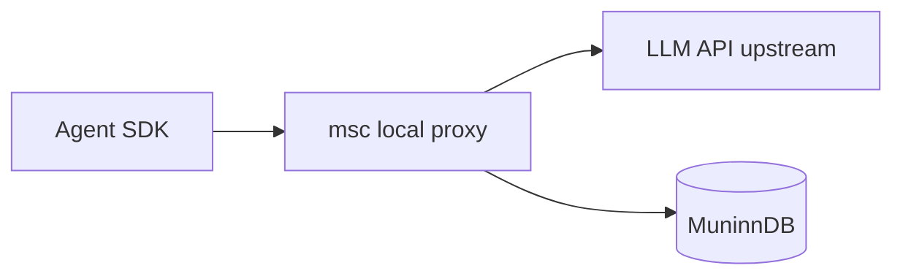
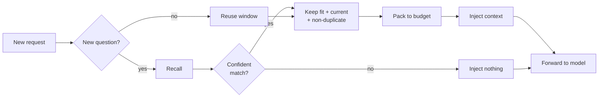

# msc — muninn sidecar

A transparent reverse proxy that gives any stateless AI coding agent **long-term memory** by automatically capturing conversations and injecting relevant context from [MuninnDB](https://github.com/scrypster/muninn).



`msc` overrides the agent's API base URL environment variable to route traffic through a local proxy. All traffic is forwarded transparently, giving you two key features with zero configuration required in the agent itself:

1. **Auto-Memorization**: LLM completion endpoints are captured and stored as semantic memories in MuninnDB.
2. **Auto-Injection**: Before forwarding a request, `msc` automatically recalls relevant past memories based on the conversation and injects them seamlessly into the system prompt.

This allows agents to magically "remember" project context, conventions, and past debugging sessions across restarts, and even across different agents (e.g., sharing context between Claude and Codex).

## Supported agents

| Agent | Env var | Default upstream |
|-------|---------|-----------------|
| `claude` | `ANTHROPIC_BASE_URL` | `api.anthropic.com` |
| `codex` | `OPENAI_BASE_URL`◊ | `api.openai.com` |
| `opencode` | `OPENAI_BASE_URL` | `api.openai.com` |
| `aider` | `OPENAI_API_BASE` | `api.openai.com` |
| `grok` | `GROK_MODELS_BASE_URL` | `api.x.ai/v1`‡ |
| `reasonix` | `DEEPSEEK_BASE_URL` | `api.deepseek.com/v1` |
| `qwen` | `--openai-base-url` flag¶ | `dashscope-intl.aliyuncs.com/compatible-mode/v1` |
| `agy`§ | `CODE_ASSIST_ENDPOINT` | `cloudcode-pa.googleapis.com`† |
| `antigravity`*| `CODE_ASSIST_ENDPOINT` | `cloudcode-pa.googleapis.com`† |

*(The Gemini CLI was removed — deprecated upstream. The Gemini/Code-Assist API format is still supported for `agy`/`antigravity`.)*

*¶ `qwen` (Qwen Code, a Gemini-CLI fork) takes its base URL from the `--openai-base-url` flag, not an env var, so msc injects `--auth-type openai --openai-base-url <proxy>` automatically. Set `OPENAI_BASE_URL` to redirect to a custom/local upstream (e.g. `http://127.0.0.1:11434/v1` for ollama); you supply the API key as usual.*

*\* Antigravity support is currently broken. It is hidden behind the `MSC_EXPERIMENTAL_ANTIGRAVITY=1` environment variable feature gate.*

*† When `GEMINI_API_KEY` is set and `CODE_ASSIST_ENDPOINT` is not, the upstream is `generativelanguage.googleapis.com` instead.*

*‡ Setting `GROK_MODELS_BASE_URL` switches grok to API-key (Bearer) auth, so an xAI API key must be configured; grok then routes inference (OpenAI-compatible) through the proxy.*

*◊ codex captures only in **API-key mode** (`OPENAI_API_KEY`). In ChatGPT-subscription mode (`auth_mode: chatgpt` in `~/.codex/auth.json`) it talks to the ChatGPT backend over a WebSocket and ignores `OPENAI_BASE_URL`, so the env-override path is bypassed. `--mitm` intercepts and runs codex correctly (the WebSocket is spliced through; verified live), but the WebSocket-framed exchange isn't parsed for capture yet — so codex runs through msc but its turns aren't stored in MuninnDB.*

*§ `agy` (Google Antigravity CLI) is registered so `msc agy` launches it, but in testing it authenticates via OAuth and talks to its upstream directly, ignoring the base-URL env override. The env-override path can't capture or inject for it (same limitation as `antigravity`); `--mitm` is the way to intercept these.*

### Installation

```bash
go install github.com/maci0/muninn-sidecar/cmd/msc@latest
```

Or build from source:

```bash
git clone https://github.com/maci0/muninn-sidecar.git
cd muninn-sidecar
make build
```

## Usage

```bash
# Basic usage — launch an agent with API capture
msc claude
msc codex
msc grok

# Pass arguments through to the agent
msc claude -p "explain this codebase"
msc aider --model gpt-4o

# Capture into a specific MuninnDB vault
msc --vault myproject claude

# Preview config without launching
msc --dry-run opencode

# Suppress msc output
msc --quiet claude

# Launch even if MuninnDB is unreachable (captures will be lost)
msc --force claude

# Check MuninnDB connectivity
msc status
msc --json status

# List supported agents
msc list
msc --json list

# Print the TLS-MITM CA cert path + fingerprint (to trust it in other tools)
msc ca
msc --json ca

# Install shell completions
msc completion zsh > ~/.zsh_functions/_msc
msc completion bash >> ~/.bashrc
msc completion fish > ~/.config/fish/completions/msc.fish

# Disable memory injection
msc --no-inject claude
```

Flags must come before the agent name. Everything after it passes through to the agent unmodified. Use `--` to separate if needed:

```bash
msc -- claude --weird-flag
```

## How it works

1. `msc` starts a local reverse proxy on a random port
2. It resolves the real upstream URL from the agent's environment (or uses the default)
3. It overrides the agent's API base URL env var to point at the local proxy
4. The agent launches and sends API requests through the proxy
5. All traffic is forwarded transparently (no extra headers, no modified User-Agent)
6. Requests matching the agent's `CapturePaths` (e.g. `/v1/messages`, `GenerateContent`) are captured
7. Captured exchanges are sent to MuninnDB asynchronously via MCP JSON-RPC

### Memory injection

By default, `msc` enriches outgoing LLM requests with relevant memories recalled from MuninnDB. The latest user turn is used as the semantic search query (a benchmark showed concatenating prior turns roughly halves retrieval — see [docs/experiments.md](docs/experiments.md)), and matching memories are injected as system-level context (format-appropriate for Anthropic, OpenAI, and Gemini APIs). Injected context is stripped before storing captured exchanges to prevent recursive reinforcement. Use `--no-inject` to disable this.

`msc` decides *when* to ask MuninnDB, *which* recalled memories to inject, and *when to inject nothing at all* — entirely in-flight, with no agent involvement. Each turn:



Recall on the latest user message → gate on the auto-calibrated cosine confidence → drop unfit memories (MuninnDB-flagged `archived`/`cancelled`/`untrusted`) → resolve staleness and contradictions (a current fact supersedes a stale or contradicted one) → pack within the token budget. The recall mode, the gate, and the skip-redundant-recall trigger were all tuned against a real MuninnDB instance. (Full decision flow + the plain-language walkthrough: [docs/recall-and-injection.md](docs/recall-and-injection.md).)

A downstream eval across **~10 local models** (Qwen2.5/Qwen3, Gemma2/3, Llama3.2, Nemotron, Phi3.5, Granite) and a broad dataset zoo seeded from HuggingFace (extractive, multi-hop, yes/no, claim-verification, scientific, medical, code, multilingual, long-narrative, informal — see `scripts/fetch_hf_datasets.py`) found a clean law: **injection's value ≈ retrieval accuracy × the model's ability to use context, and a wrong injection never helps.** It's most stark on questions a model *cannot* answer without memory — agent-memory facts (F1 0.00 → 0.67–0.88) and NL→code recall (0.03 → 0.81). That's exactly why the sidecar both recalls accurately and *gates* (inject confident recalls, suppress the rest). An optional answer-grounding rerank (`--ground-url` / `--ground-cmd`) adds a per-recall LLM precision check for harm-prone vaults. See [docs/recall-and-injection.md](docs/recall-and-injection.md) for the design, [docs/model-eval.md](docs/model-eval.md) for the cross-model results, and [docs/experiments.md](docs/experiments.md) for the full study log.

### TLS-MITM mode (`--mitm`)

The default path overrides the agent's API base-URL env var. Some agents ignore
that override and talk to their provider directly (codex in ChatGPT-subscription
mode, grok session auth, agy/antigravity OAuth). `--mitm` intercepts those by
turning msc into a transparent HTTPS proxy:

1. On first use, msc creates a local certificate authority under your config dir
   (`~/.config/muninn-sidecar/mitm/`). The CA private key is `0600`, **never leaves
   the machine**, and is trusted only by the agent msc launches — never installed
   into the system trust store.
2. The child is launched with `HTTP(S)_PROXY` / `ALL_PROXY` (upper and lower case)
   pointing at msc, and `NODE_EXTRA_CA_CERTS` / `SSL_CERT_FILE` /
   `REQUESTS_CA_BUNDLE` / `CURL_CA_BUNDLE` pointing at the CA cert so the minted
   leaf certs verify.
3. The agent opens an HTTPS `CONNECT` tunnel through msc. msc replies `200`,
   completes the TLS handshake with a per-host leaf cert it mints on the fly, then
   runs the decrypted request through the **same recall/inject + capture pipeline**
   as the plain path, re-originating TLS to the real upstream.

```
msc --mitm claude
```

The child is launched with proxy + CA-trust env vars covering every runtime our
agents use, verified with a per-runtime interception probe (request reaches msc
only if it routed through the proxy *and* trusted the CA):

| Runtime | Agents | Notes |
|---|---|---|
| Node / undici `fetch` | claude, qwen, reasonix | needs `NODE_USE_ENV_PROXY=1` (set automatically) — undici otherwise ignores `HTTPS_PROXY` |
| Rust / `reqwest` | codex, grok | honors `HTTPS_PROXY` + system store (`SSL_CERT_FILE`) |
| Bun `fetch` | opencode | node-compatible (`NODE_EXTRA_CA_CERTS`) |
| Deno `fetch` | — | `DENO_CERT` set for trust |
| Python `requests`/urllib | aider | `REQUESTS_CA_BUNDLE` / `SSL_CERT_FILE` |
| Go `net/http` | agy | honors proxy env + `SSL_CERT_FILE` |

The key gotcha: Node's global `fetch` (undici) — used by the Anthropic/OpenAI SDKs
— silently ignores `HTTPS_PROXY` unless `NODE_USE_ENV_PROXY=1` (Node 24+); msc sets
it so claude/qwen/reasonix are actually intercepted.

By default `--mitm` intercepts **every** host the agent connects to — deliberately,
since the agents that need MITM (e.g. codex ChatGPT-mode) often talk to a backend
that *isn't* their nominal API host. To narrow it, `--mitm-host HOST` (repeatable /
comma-separated) scopes interception to the upstream plus the listed hosts and
**blind-tunnels everything else untouched** — so package registries, OAuth, and
cert-pinned services are never decrypted:

```
msc --mitm codex                                  # intercept all hosts
msc --mitm-host api.openai.com,chatgpt.com codex  # intercept only these, tunnel the rest
```

MITM is **off by default** — only the explicit `--mitm` flag enables it. Use it for
agents that bypass the base-URL override; the plain proxy remains the default for
everything else.

### Streaming

SSE streaming responses are handled incrementally — chunks flow through to the agent in real-time. Text deltas are accumulated from content events across all API formats (Anthropic, OpenAI, and Gemini). At stream completion, a synthetic response is built from the accumulated text for storage, with usage metadata merged from the last usage-bearing event. Falls back to the last `data:` line if no text deltas or tool names were captured.

### Nested invocations

`msc` sets `MSC_UPSTREAM` in the child environment so nested `msc` calls detect the real upstream and avoid infinite proxy loops.

## Configuration

### Environment variables

| Variable | Description |
|----------|-------------|
| `MUNINN_MCP_URL` | MuninnDB MCP endpoint (default: `http://127.0.0.1:8750/mcp`) |
| `MUNINN_TOKEN` | MuninnDB bearer token (default: reads `~/.muninn/mcp.token`) |
| `MSC_VAULT` | MuninnDB vault name (default: current directory name, fallback: `sidecar`) |

Command-line flags take precedence over environment variables.

### Flags

```
-h, --help            Show help
-v, --version         Show version
-d, --debug           Enable debug logging (verbose structured output)
-q, --quiet           Suppress msc's own output
-n, --dry-run         Show resolved config without launching
-j, --json            Machine-readable output (for list, status, version)
-f, --force           Launch even if MuninnDB is unreachable
    --no-inject       Disable memory injection (enabled by default)
    --inject-budget N Max tokens to inject per request (default: 2048)
    --inject-min-score F  Min cosine score to inject a memory, 0-1 (default: 0.6)
    --recall-mode MODE    MuninnDB recall mode: semantic|recent|balanced|deep (default: semantic)
    --ground-url URL      Opt-in answer-grounding rerank via an OpenAI-compatible model (fast local judge, ~1s); drops recalled passages the model says don't answer the query
    --ground-cmd CMD      Answer-grounding rerank via a CLI agent (e.g. "claude -p"); frontier-quality but slow (~3.5s) — best for offline use
    --ground-model NAME   Grounding model for --ground-url (default: qwen2.5:7b-instruct)
    --ground-topk K       Candidates to ground per recall (default: 3)
    --ground-timeout D    In-flight grounding-call timeout (default: 10s); a slow judge fails open to the cosine gate
    --mitm            Intercept HTTPS via a local CA + CONNECT proxy instead of a base-URL
                      override (for agents that ignore *_BASE_URL); the child is told to
                      trust msc's CA via NODE_EXTRA_CA_CERTS / SSL_CERT_FILE
    --mitm-host HOST  Scope MITM to HOST (repeatable/comma-separated; implies --mitm). Only
                      upstream + listed hosts are terminated; others blind-tunnel. Default: all
    --log-json        Emit logs as JSON (for log aggregation pipelines)
    --vault NAME      MuninnDB vault name
    --mcp-url URL     MuninnDB MCP endpoint
    --token TOKEN     MuninnDB bearer token
```

## Prerequisites

- [MuninnDB](https://github.com/scrypster/muninn) running locally (or reachable via `MUNINN_MCP_URL`)
- The coding agent binary installed and in `PATH`

## License

MIT
