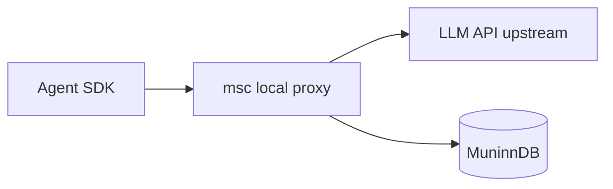
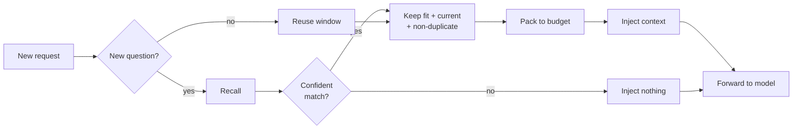

# msc — muninn sidecar

A transparent reverse proxy that gives any stateless AI coding agent **long-term memory** by automatically capturing conversations and injecting relevant context from [MuninnDB](https://github.com/scrypster/muninn).


```mermaid
flowchart LR
    A[Agent SDK] --> B[msc local proxy]
    B --> C[LLM API upstream]
    B --> D[(MuninnDB)]
```

`msc` overrides the agent's API base URL environment variable to route traffic through a local proxy. All traffic is forwarded transparently, giving you two key features with zero configuration required in the agent itself:

1. **Auto-Memorization**: LLM completion endpoints are captured and stored as semantic memories in MuninnDB.
2. **Auto-Injection**: Before forwarding a request, `msc` automatically recalls relevant past memories based on the conversation and injects them seamlessly into the system prompt.

This allows agents to magically "remember" project context, conventions, and past debugging sessions across restarts, and even across different agents (e.g., sharing context between Claude and Codex).

## Supported agents

| Agent | Env var | Default upstream |
|-------|---------|-----------------|
| `claude` | `ANTHROPIC_BASE_URL` | `api.anthropic.com` |
| `codex` | `OPENAI_BASE_URL`◊ | `api.openai.com` |
| `opencode` | `OPENAI_BASE_URL` | `api.openai.com` |
| `aider` | `OPENAI_API_BASE` | `api.openai.com` |
| `grok` | `GROK_MODELS_BASE_URL` | `api.x.ai/v1`‡ |
| `qwen` | `--openai-base-url` flag¶ | `dashscope-intl.aliyuncs.com/compatible-mode/v1` |
| `agy`§ | `CODE_ASSIST_ENDPOINT` | `cloudcode-pa.googleapis.com`† |

*(The Gemini CLI was removed — deprecated upstream. The Gemini/Code-Assist API format is still supported for `agy`.)*

*¶ `qwen` (Qwen Code, a Gemini-CLI fork) takes its base URL from the `--openai-base-url` flag, not an env var, so msc injects `--auth-type openai --openai-base-url <proxy>` automatically. Set `OPENAI_BASE_URL` to redirect to a custom/local upstream (e.g. `http://127.0.0.1:11434/v1` for ollama); you supply the API key as usual. As a Gemini-CLI fork it also speaks the Gemini API (`:generateContent`) in Google auth mode — both formats are captured.*

*† When `GEMINI_API_KEY` is set and `CODE_ASSIST_ENDPOINT` is not, the upstream is `generativelanguage.googleapis.com` instead.*

*‡ Setting `GROK_MODELS_BASE_URL` switches grok to API-key (Bearer) auth, so an xAI API key must be configured; grok then routes inference (OpenAI-compatible) through the proxy. In its default subscription mode grok instead talks to `cli-chat-proxy.grok.com` via the OpenAI Responses API (`POST /v1/responses`) over HTTPS, ignoring the env override — use `--mitm` to capture it (verified end-to-end).*

*◊ codex captures only in **API-key mode** (`OPENAI_API_KEY`) over plain HTTP. In ChatGPT-subscription mode (`auth_mode: chatgpt` in `~/.codex/auth.json`) it talks to the ChatGPT backend over a permessage-deflate **WebSocket** and ignores `OPENAI_BASE_URL` — so it needs `--mitm`. With `--mitm`, msc decodes that WebSocket (RFC 6455 framing + RFC 7692 context-takeover inflation) and captures codex's turns (the Responses-API request + the streamed answer); verified live.*

*§ `agy` (Google Antigravity CLI) is registered so `msc agy` launches it, but in testing it authenticates via OAuth and talks to its upstream directly, ignoring the base-URL env override. `--mitm` does intercept agy's HTTPS (auth/register/userinfo verified live), but its inference runs over gRPC/protobuf on cloudcode-pa — not the JSON msc's extractors read — so turns are not yet captured in a usable form (full support would need protobuf decoding).*

### Installation

```bash
go install github.com/maci0/muninn-sidecar/cmd/msc@latest
```

Or build from source:

```bash
git clone https://github.com/maci0/muninn-sidecar.git
cd muninn-sidecar
make build
```

### Platforms

`msc` builds for Linux and macOS on amd64 and arm64, plus Windows on amd64,
and CI builds and vets each of them. The binaries are statically linked
(`CGO_ENABLED=0`), so a Linux build runs on any libc rather than only the one
on the machine that produced it. The test suite runs only on Linux, so the
other targets are compile-verified, not exercised end to end. Two behaviors
differ by platform and are handled rather than assumed:

- **Signal forwarding to the agent.** msc walks `/proc` to find the agent and
  skip a Ctrl+C the terminal already delivered. Without `/proc` (macOS, Windows)
  it signals the agent process handle directly; SIGINT is still left to the
  kernel, since the agent shares msc's process group either way.
- **MITM trust.** `SSL_CERT_FILE` and friends need a file to point at, so on
  Linux and macOS the combined CA bundle is built from the system bundle msc
  can find (`/etc/ssl/certs/ca-certificates.crt`,
  `/etc/pki/tls/certs/ca-bundle.crt`, `/etc/ssl/ca-bundle.pem`,
  `/etc/ssl/cert.pem`, or `$SSL_CERT_FILE`). Windows keeps its roots in the OS
  certificate store rather than a PEM file, so there is nothing to combine
  with; `msc ca` says so instead of naming a bundle that is never written.

## Usage

```bash
# Basic usage — launch an agent with API capture
msc claude
msc codex
msc grok

# Pass arguments through to the agent
msc claude -p "explain this codebase"
msc aider --model gpt-4o

# Capture into a specific MuninnDB vault
msc --vault myproject claude

# Preview config without launching
msc --dry-run opencode

# Suppress msc output
msc --quiet claude

# Launch even if MuninnDB is unreachable (captures will be lost)
msc --force claude

# Check MuninnDB connectivity (and vault memory count — "is it populated?")
msc status
msc --json status

# List supported agents
msc list
msc --json list

# Print the TLS-MITM CA cert path + fingerprint (to trust it in other tools)
msc ca
msc --json ca

# Help for one command or agent (same as 'msc <command> --help')
msc help status
msc help claude

# Install shell completions
msc completion zsh > ~/.zsh_functions/_msc
msc completion bash >> ~/.bashrc
msc completion fish > ~/.config/fish/completions/msc.fish

# Disable memory injection
msc --no-inject claude
```

Flags must come before the agent name. Everything after it passes through to the agent unmodified. Use `--` to separate if needed:

```bash
msc -- claude --weird-flag
```

The commands above are the exception: their flags may follow the name, so
`msc list --json` and `msc --json list` are the same.

`msc` exits `0` on success, `1` when MuninnDB is unreachable, `2` on a usage
error, and `127` when the agent binary is not in `PATH`. When the agent itself
exits, its code is propagated (`128+N` if a signal killed it).

```bash
msc claude || echo "agent run failed with $?"
```

## How it works

1. `msc` starts a local reverse proxy on a random port
2. It resolves the real upstream URL from the agent's environment (or uses the default)
3. It overrides the agent's API base URL env var to point at the local proxy
4. The agent launches and sends API requests through the proxy
5. All traffic is forwarded transparently (no extra headers, no modified User-Agent)
6. Requests matching the agent's `CapturePaths` (e.g. `/v1/messages`, `GenerateContent`) are captured
7. Captured exchanges are scrubbed of well-known secrets and personal data (API keys, tokens, private keys, emails, payment-card numbers, SSNs → `[REDACTED]`, your home-directory path → `[HOME]`) and sent to MuninnDB asynchronously via MCP JSON-RPC

### Memory injection

By default, `msc` enriches outgoing LLM requests with relevant memories recalled from MuninnDB. The latest user turn is used as the semantic search query (a benchmark showed concatenating prior turns roughly halves retrieval — see [docs/experiments.md](docs/experiments.md)), and matching memories are injected as system-level context (format-appropriate for Anthropic, OpenAI, and Gemini APIs). Injected context is stripped before storing captured exchanges to prevent recursive reinforcement. Use `--no-inject` to disable this.

`msc` decides *when* to ask MuninnDB, *which* recalled memories to inject, and *when to inject nothing at all* — entirely in-flight, with no agent involvement. Each turn:


```mermaid
flowchart LR
    Q[New request] --> ASK{New question?}
    ASK -- no --> REUSE[Reuse window]
    ASK -- yes --> RECALL[Recall] --> GATE{Confident<br/>match?}
    GATE -- no --> NONE[Inject nothing]
    GATE -- yes --> CLEAN[Keep fit + current<br/>+ non-duplicate] --> BUDGET[Pack to budget] --> INJECT[Inject context]
    REUSE --> CLEAN
    INJECT --> FWD[Forward to model]
    NONE --> FWD
```

Recall on the latest user message → gate on the auto-calibrated cosine confidence → drop unfit memories (MuninnDB-flagged `archived`/`cancelled`/`untrusted`) → resolve staleness and contradictions (a current fact supersedes a stale or contradicted one) → pack within the token budget. The recall mode, the gate, and the skip-redundant-recall trigger were all tuned against a real MuninnDB instance. (Full decision flow + the plain-language walkthrough: [docs/recall-and-injection.md](docs/recall-and-injection.md).)

A downstream eval across **~10 local models** (Qwen2.5/Qwen3, Gemma2/3, Llama3.2, Nemotron, Phi3.5, Granite) and a broad dataset zoo seeded from HuggingFace (extractive, multi-hop, yes/no, claim-verification, scientific, medical, code, multilingual, long-narrative, informal — see `scripts/fetch_hf_datasets.py`) found a clean law: **injection's value ≈ retrieval accuracy × the model's ability to use context, and a wrong injection never helps.** It's most stark on questions a model *cannot* answer without memory — agent-memory facts (F1 0.00 → 0.67–0.88) and NL→code recall (0.03 → 0.81). That's exactly why the sidecar both recalls accurately and *gates* (inject confident recalls, suppress the rest). An optional answer-grounding rerank (`--ground-url` / `--ground-cmd`) adds a per-recall LLM precision check for harm-prone vaults. See [docs/recall-and-injection.md](docs/recall-and-injection.md) for the design, [docs/model-eval.md](docs/model-eval.md) for the cross-model results, and [docs/experiments.md](docs/experiments.md) for the full study log.

### TLS-MITM mode (`--mitm`)

The default path overrides the agent's API base-URL env var. Some agents ignore
that override and talk to their provider directly (codex in ChatGPT-subscription
mode, grok session auth, agy OAuth). `--mitm` intercepts those by
turning msc into a transparent HTTPS proxy:

1. On first use, msc creates a local certificate authority under your config dir
   (`~/.config/muninn-sidecar/mitm/`). The CA private key is `0600`, **never leaves
   the machine**, and is trusted only by the agent msc launches — never installed
   into the system trust store.
2. The child is launched with `HTTP(S)_PROXY` / `ALL_PROXY` (upper and lower case)
   pointing at msc, and `NODE_EXTRA_CA_CERTS` / `SSL_CERT_FILE` /
   `REQUESTS_CA_BUNDLE` / `CURL_CA_BUNDLE` pointing at the CA cert so the minted
   leaf certs verify.
3. The agent opens an HTTPS `CONNECT` tunnel through msc. msc replies `200`,
   completes the TLS handshake with a per-host leaf cert it mints on the fly, then
   runs the decrypted request through the **same recall/inject + capture pipeline**
   as the plain path, re-originating TLS to the real upstream.

```
msc --mitm claude
```

The child is launched with proxy + CA-trust env vars covering every runtime our
agents use, verified with a per-runtime interception probe (request reaches msc
only if it routed through the proxy *and* trusted the CA):

| Runtime | Agents | Notes |
|---|---|---|
| Node / undici `fetch` | claude, qwen | needs `NODE_USE_ENV_PROXY=1` (set automatically) — undici otherwise ignores `HTTPS_PROXY` |
| Rust / `reqwest` | codex, grok | honors `HTTPS_PROXY` + system store (`SSL_CERT_FILE`) |
| Bun `fetch` | opencode | node-compatible (`NODE_EXTRA_CA_CERTS`) |
| Deno `fetch` | — | `DENO_CERT` set for trust |
| Python `requests`/urllib | aider | `REQUESTS_CA_BUNDLE` / `SSL_CERT_FILE` |
| Go `net/http` | agy | honors proxy env + `SSL_CERT_FILE` |

The key gotcha: Node's global `fetch` (undici) — used by the Anthropic/OpenAI SDKs
— silently ignores `HTTPS_PROXY` unless `NODE_USE_ENV_PROXY=1` (Node 24+); msc sets
it so claude/qwen are actually intercepted.

By default `--mitm` intercepts **every** host the agent connects to — deliberately,
since the agents that need MITM (e.g. codex ChatGPT-mode) often talk to a backend
that *isn't* their nominal API host. To narrow it, `--mitm-host HOST` (repeatable /
comma-separated) scopes interception to the upstream plus the listed hosts and
**blind-tunnels everything else untouched** — so package registries, OAuth, and
cert-pinned services are never decrypted:

```
msc --mitm codex                                  # intercept all hosts
msc --mitm-host api.openai.com,chatgpt.com codex  # intercept only these, tunnel the rest
```

MITM is **off by default** — only the explicit `--mitm` flag enables it. Use it for
agents that bypass the base-URL override; the plain proxy remains the default for
everything else.

### Streaming

SSE streaming responses are handled incrementally — chunks flow through to the agent in real-time. Text deltas are accumulated from content events across all API formats (Anthropic, OpenAI, and Gemini). At stream completion, a synthetic response is built from the accumulated text for storage, with usage metadata merged from the last usage-bearing event. Falls back to the last `data:` line if no text deltas or tool names were captured.

### Nested invocations

`msc` sets a per-agent `MSC_UPSTREAM_<AGENT>` sentinel (e.g. `MSC_UPSTREAM_CLAUDE`) in the child environment so a nested `msc` for the same agent detects the real upstream and avoids infinite proxy loops, while a nested `msc` for a different agent resolves its own upstream.

## Seeing what the sidecar is doing

When the agent misbehaves, three things answer the usual questions: did the turn succeed, how long did it take, and which dependency failed.

**End of session.** `msc` prints a summary on exit: memories saved/deduped/skipped/dropped, save errors, upstream errors, proxy errors, token totals, injection counts, the per-model breakdown, and the mean and slowest response time.

**The status endpoint.** The proxy itself answers `GET /__msc/health` while the session is running (the port is printed in the startup line, or is random with `--dry-run` showing the plan):

```console
$ curl -s http://127.0.0.1:41287/__msc/health
{"status":"ok","degraded":false,"agent":"claude","upstream":"https://api.anthropic.com","uptime_s":214,"store_queue":{"depth":0,"capacity":256,"saturated":false},"stats":{"requests":11,"captured":9,"saved":9,"dropped":0,"save_errors":0,"upstream_errors":1,"proxy_errors":0,"injections":6,"injection_errors":0,"recalls":7,"latency_samples":2,"latency_mean_ms":11515,"latency_max_ms":18720}}
```

`status` answers liveness and `degraded` answers health, separately, because a sidecar that is up but no longer saving memories should not be restarted: it keeps proxying, and killing it would take the agent's API path down with it. When `degraded` is true, `degraded_reasons` names what is failing (proxy transport errors, delivery errors to MuninnDB, dropped captures, a full store queue) and `store_queue` gives the depth that causes drops. An upstream 4xx/5xx is the provider's answer, forwarded to the agent unchanged, and does not count as degraded. The endpoint does not probe MuninnDB, so an outage shows up as climbing `save_errors` rather than as a failing probe; reachability is checked once at startup, and `msc` refuses to launch without `--force`.

`requests` counts everything the agent sent, so `requests / uptime_s` is the request rate; `captured` counts only the exchanges that reached the store, which is what makes a session that is answering but no longer capturing visible.

**The logs.** Text on stderr by default, JSON with `--log-json`. The default level is WARN, so a healthy session is quiet; `--debug` adds per-request detail. Every request gets a `request_id` (`req-1`, `req-2`, …) carried in the request context, never in a header, and every log line on the request path carries it, including the store's background worker, so the lines belonging to one turn can be picked out when a session interleaves several:

```console
$ msc --debug claude
time=2026-09-27T11:41:21.944+08:00 level=WARN msg="upstream error response" request_id=req-1 status=429 method=POST path=/v1/messages agent=claude duration_ms=812
time=2026-09-27T11:41:21.950+08:00 level=ERROR msg="proxy error" request_id=req-2 err="dial tcp 127.0.0.1:1: connect: connection refused" method=POST path=/v1/messages agent=claude
```

With `--log-json` the same lines are JSON objects, so a log pipeline can key on `level`, `msg`, and `request_id` without parsing a message string.

A 4xx/5xx from the provider is a warn (the provider refused) and counts as an upstream error; a failure msc itself causes is an error and counts as a proxy error; a request you cancelled (Ctrl-C in the agent) is debug-level noise and counts as neither. See [ARCHITECTURE.md](ARCHITECTURE.md#observability) for the full picture.

## Configuration

### Environment variables

| Variable | Description |
|----------|-------------|
| `MUNINN_MCP_URL` | MuninnDB MCP endpoint (default: `http://127.0.0.1:8750/mcp`) |
| `MUNINN_TOKEN` | MuninnDB bearer token (default: reads `~/.muninn/mcp.token`) |
| `MSC_VAULT` | MuninnDB vault name (default: current directory name, fallback: `sidecar`) |
| `OPENAI_API_KEY` | Bearer token for the answer-grounding judge when `--ground-url` targets an OpenAI-compatible endpoint that requires auth (optional; unneeded for unauthenticated local endpoints like ollama) |
| `MSC_WS_DEBUG` | When set (with `--debug`, since the probe logs at INFO), log the envelope `type` and size of every decoded WebSocket message under `--mitm` (not the content) — to map a new agent's WebSocket protocol for capture |

Command-line flags take precedence over environment variables, which take precedence over defaults. `MUNINN_MCP_URL` is validated at startup: a value without an `http`/`https` scheme or without a host is rejected before anything is launched, naming the offending value instead of failing later inside the connectivity check. All four binaries (`msc`, `msc-eval`, `msc-bench`, `msc-qa`) resolve these variables through the same `internal/config` package, so a default or env var name cannot drift between them.

To inspect the resolved configuration without launching anything, run `msc --dry-run <agent>` (add `--json` for machine output); it prints the upstream, the env vars the child will receive, the vault, the MuninnDB endpoint and its reachability, and the injection settings. Secrets are never printed: the token is resolved but not echoed.

### Flags

```
-h, --help            Show help
-v, --version         Show version
-d, --debug           Enable debug logging (verbose structured output)
-q, --quiet           Suppress msc's own output
-n, --dry-run         Show resolved config without launching
-j, --json            Machine-readable output (for list, status, ca, version, --dry-run)
-f, --force           Launch even if MuninnDB is unreachable
    --no-inject       Disable memory injection (enabled by default)
    --inject-budget N Max tokens to inject per request (default: 2048)
    --inject-min-score F  Min cosine score to inject a memory, in (0,1] (default: 0.6)
    --no-auto-calibrate   Disable per-vault auto-calibration of the injection gate (calibrated by default)
    --recall-mode MODE    MuninnDB recall mode: semantic|recent|balanced|deep (default: semantic)
    --ground-url URL      Opt-in answer-grounding rerank via an OpenAI-compatible model (fast local judge, ~1s); drops recalled passages the model says don't answer the query
    --ground-cmd CMD      Answer-grounding rerank via a CLI agent (e.g. "claude -p"); frontier-quality but slow (~3.5s) — best for offline use
                          (quote a path containing spaces: "C:\Program Files\...\claude.exe")
    --ground-model NAME   Grounding model for --ground-url (default: qwen2.5:7b-instruct)
    --ground-topk K       Candidates to ground per recall (default: 3)
    --ground-timeout D    In-flight grounding-call timeout (default: 10s); a slow judge fails open to the cosine gate
                          (--ground-model, --ground-topk, --ground-timeout require --ground-url
                          or --ground-cmd; without a backend they are rejected)
    --mitm            Intercept HTTPS via a local CA + CONNECT proxy instead of a base-URL
                      override (for agents that ignore *_BASE_URL); the child is told to
                      trust msc's CA via NODE_EXTRA_CA_CERTS / SSL_CERT_FILE
    --mitm-host HOST  Scope MITM to HOST (repeatable/comma-separated; implies --mitm). Only
                      upstream + listed hosts are terminated; others blind-tunnel. Default: all
    --no-redact       Disable secret redaction of captured content (full-fidelity capture;
                      trusted environments only — secrets will be stored verbatim)
    --log-json        Emit logs as JSON (for log aggregation pipelines)
    --vault NAME      MuninnDB vault name
    --mcp-url URL     MuninnDB MCP endpoint
    --token TOKEN     MuninnDB bearer token
```

## Limitations

- **OAuth-direct / non-override agents.** Agents that ignore a base-URL env
  override need `--mitm` (codex ChatGPT-mode, grok default mode, agy). codex
  ChatGPT-mode streams over a permessage-deflate WebSocket; msc decodes and
  captures it (RFC 6455 + RFC 7692). grok's default mode is plain HTTPS
  (`/v1/responses`) and is captured directly. Any *other* WebSocket protocol is
  spliced through but not decoded — it runs but isn't captured (the session
  summary reports such streams). See
  [docs/websocket-agents.md](docs/websocket-agents.md) for which agents stream
  over WebSocket and how to map a new protocol with `MSC_WS_DEBUG`.
- **Single upstream without `--mitm`.** The default proxy forwards to one resolved
  upstream (the agent's API). An agent that talks to several API hosts needs
  `--mitm` (which intercepts per-CONNECT-host).
- **Best-effort capture.** Captures are async and bounded: if MuninnDB is
  unreachable or the queue (depth 256) fills, exchanges are dropped rather than
  blocking the agent; shutdown flushing is time-bounded (~8s). Recall/injection
  fail open — a MuninnDB hiccup never blocks or corrupts a request.
- **Secret redaction is best-effort.** Captured content is scrubbed of well-known
  credential formats and personal data (emails, payment-card numbers, SSNs,
  phone numbers, and your own home-directory path, which is a direct identifier
  on macOS and Windows where the leaf is the account's real name)
  before storage, but the patterns are conservative and not
  exhaustive — it reduces, not eliminates, the risk of a secret reaching the
  store. Don't rely on it as a reason to paste secrets into an agent. It runs both
  before storage (disable with `--no-redact` for full-fidelity local capture) and,
  always, on recalled memory content before injection (so old/cross-client secrets
  aren't re-sent to the provider), on the recall query before it reaches the memory
  backend, and on the answer-grounding judge prompt.
- **MITM trust.** `--mitm` is opt-in. The CA private key is generated locally,
  stored `0600`, and trusted only by the agent msc launches — never the system
  trust store (`msc ca` prints the cert for trusting it elsewhere yourself).

## Prerequisites

- [MuninnDB](https://github.com/scrypster/muninn) running locally (or reachable via `MUNINN_MCP_URL`)
- The coding agent binary installed and in `PATH`

## Contributing

Clone needs Go 1.25+ and a C compiler (for `go test -race`); `make doctor`
checks that and what else the tree needs. `make tools` adds the two linters CI
runs, `make help` lists every target, and `make check` reproduces the CI test
job locally.

See [CONTRIBUTING.md](CONTRIBUTING.md) for the build/test/fuzz workflow, the
quality bar, how to add an agent (verify empirically), and commit conventions.

## License

[MIT](LICENSE)
